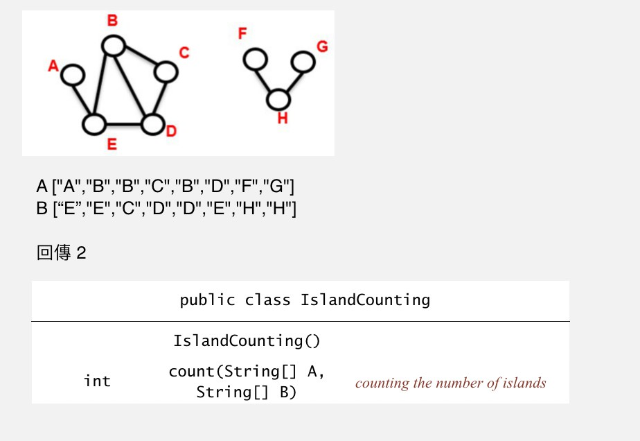

# Island Counting
給定兩個字串陣列，陣列元素代表小島，不同陣列的同一個索引代表連線，回傳幾個孤島。講簡單一點就是找有幾個連通單元(connected component)

 

## 爆力破解法
把有連線的島嶼都換成同一個符號，再計算符號做到哪，這基本上就是個垃圾

## DFS + HashMap
將所有點對應成數字，並製作 Adjacency list，最後使用 DFS 走訪看能走訪出幾種圖

這種作法十分複雜，而且效能還很差，吃力不討好

而且 DFS 要改成迭代，自己試，用遞迴會 Stack Overflow

```java
private MyStack s;
private boolean[] visited;
private AdjList list;
private void dfs(int i){
    int tmp;
    MyStack current;
    s.push(i);
    while(s.isNotEmpty()){
        i = s.pop();
        if(!visited[i]){
            visited[i] = true;
            for(current = list.getEntrylistByIndex(i); current.isNotEmpty();){
                tmp = current.pop();
                if(!visited[tmp]){
                    s.push(tmp);
                }
            }
        }
    }
}
```

## DFS + HashMap + Thread
製作 Adjacency list 時開 8 條執行緒，效果比我第一次用 Union Find 實作出來要來的好

```java
// Create adjacency list by multithread
this.list = new AdjList(mapIndex);
int num_thread = 8;
Thread[] t = new Thread[num_thread];
for(int i=0; i<num_thread; i++){
    final int j = i;
    t[i] = new Thread(new Runnable(){
        public void run(){
            for(int k = j; k < len; k+= num_thread){
                //因為是無向圖，所以再加入 list 時，兩個方向都要加
                list.appendBidirectional(m.get(A[k]).val, m.get(B[k]).val);
            }
        }
    });
    t[i].start();
}
try{
    for(int i=0; i<num_thread; i++){
        t[i].join();
    }
}catch(InterruptedException e){}
```

## Union Find + HashMap

> 初期實作時我是先把所有字串都用 HashMap 轉成特定數字後(需一個額外的臨時整數陣列)才進行 Union find
>
> 後來發現這種方法根本是垃圾，於是改成先探索該字串是否存在於 HashMap。 若存在，則取得數字做 Union find，若不存在則加入 HashMap 然後也要 Union find
>

### 主程式

__主程式巧思__

+ 減少 hashMap 檢查值是否存在，put()不做重複值檢查，而是直接先由 get() 做檢查，檢查時不使用 containKey()，而是使用設計更彈性的 get，當然也可以設計 get() 返回 int 以 -1 表示無，但我這邊是直接設計他回傳 Entry 利用 null 來檢查是否存在

+ 最後回傳答案時，並不遍歷整個 Union Find 而是在 union 時就先計算 union 的次數，因為每 union 一次，孤島數(connected component)就會少一個


```java
public int count(String[] A, String[] B){
    int len = A.length;
    int index = 0;
    int indexA, indexB;
    MyHashMap m = new MyHashMap(len << 1);      //因為 resize 會浪費時間，所以初始直接給定 2 倍
    UnionFind uf = new UnionFind(len << 1);     //因為不知道有多少元素，所以一開始直接給定 2 倍
    MyHashMap.Entry hmeA, hmeB;
    for(int i=0; i<len; i++){
        hmeA = m.get(A[i]);
        if(hmeA == null){
            indexA = index++;
            m.put(A[i], indexA);
        }else{
            indexA = hmeA.val;
        }

        hmeB = m.get(B[i]);
        if(hmeB == null){
            indexB = index++;
            m.put(B[i], indexB);
        }else{
            indexB = hmeB.val;
        }
        uf.union(indexA, indexB);
    }

    return uf.howManyHead(index);
}


```
### Union Find 使用 雙陣列 一個記 id 一個記 權重

```java
private class UnionFind{
    private int[] unionFindArray;         //記綠父母節點
    private int[] unionFindArrayWeight;   //記錄權重
    private int cap;
    private int count;                    //記錄一共union幾次

    UnionFind(int size){
        this.cap = size;
        unionFindArray = new int[cap];
        unionFindArrayWeight = new int[cap];

        for(int i=0; i < cap; i++)
            unionFindArray[i] = i;  //標記為頭點
    }

    final public int find(int i){
        while(unionFindArray[i] != i){
            unionFindArray[i] = unionFindArray[unionFindArray[i]];
            i = unionFindArray[i];
        }
        return i;
    }

    final public void union(int a, int b){
        int aroot = find(a);
        int broot = find(b);
        if(aroot == broot) return;
        ++count;
        if(unionFindArrayWeight[aroot] > unionFindArrayWeight[broot]){
            unionFindArray[broot] = aroot;
        }else{
            unionFindArray[aroot] = broot;
            if(unionFindArrayWeight[aroot] == unionFindArrayWeight[broot]){
                ++unionFindArrayWeight[broot];
            }
        }
    }

    final public int howManyHead(int end){
        return end-count;
    }
}
```

### Union Find 使用 單陣列 正數及零記 id 負數記 權重
這個做法是資料結構 (Fundamentals of Data Structure in C 2nd Edition, ISBN: 0929306406) 所使用的方法，利用負數來記錄權重

```java
private class UnionFind{
    private int[] UF;
    private int cap;
    private int count;    //記算一共union幾次

    UnionFind(int size){
        this.count = 0;
        this.cap = size;
        this.UF = new int[cap];
        for(int i=0; i<cap; UF[i++] = -1); // -1 表示為頭點
    }

    final public int find(int i){
        int root, trail, lead;
        // Find root
        for(root = i; UF[root]>=0; root = UF[root]);
        // Update all nodes in the path
        for(trail = i; trail != root; trail = lead){
            lead = UF[trail];
            UF[trail] = root;
        }
        return root;
    }

    final public void union(int a, int b){
        a = find(a);
        b = find(b);
        if(a == b) return;

        int temp = UF[a] + UF[b];
        if(UF[a] > UF[b]){  // b is bigger than a
            UF[a] = b;      // b is new root
            UF[b] = temp;   // update b's weight
        }else{              // vice versa
            UF[b] = a;
            UF[a] = temp;
        }
        this.count++;
    }

    final public int howManyHead(int end){
        return end - count;
    }
}
```

### Union Find 混用
> 仔細觀察以上兩種會發現一個問題，兩種都需要浪費 O(N) 在做初始化，一個設成跟自己 index 一樣，一個則皆設為 -1 ，我們是否有方法減少這個初始化的過程？因為在java中宣告陣列都預設為 0 ，我們是否可以改以 0 做為頭點的標記

```java
//留給您
class UnionFind{
    private int[] id;
    UnionFind(){

    }
    public void union(){

    }
    private void find(){

    }
}
```

## 開執行緒 同時 Hash 同時 Union
> 我的思考是這樣子的，我們無法同時 hash 兩個字串，也沒有辦法同時 union ，但是，如果我先 hash 一部份，再 hash 下一部份時，同時 union 上一部份，是否可以節省掉 hash 所浪費的時間呢？
>
> 可以！在我的電腦上當數量達到 1000 萬時，可以 __比原方法快 2 秒__
>
> 但在伺服器上的 __改分程式並無明顯區別__
>

__實作上困難點__
> 在實作上要注意，每次 hashMap 一部分後都會呼叫 UnionFind
> 但若同時呼叫到兩支 UnionFind 的執行緒就有可能出錯，所以我們可以利用互斥鎖控制 union 的執行緒一次只執行一個

### 互斥鎖 Mutex
__主程式__

```java
final int num_thread = 16;
final int num_thread_log = 4;
public int count(String[] A, String[] B){
    int len = A.length;
    int index = 0;
    int indexA, indexB;
    MyHashMap m = new MyHashMap(len << 1);
    MyHashMap.Entry hmeA, hmeB;
    UnionFind uf = new UnionFind(len);
    int[][] union = new int[2][len];
    Mutex mutex = new Mutex();

    Thread[] t = new Thread[num_thread];

    if(len > num_thread){
        for(int j=0; j<num_thread; j++){
            final int start = ((len * j) >> num_thread_log);
            final int end = ((len * (j+1)) >> num_thread_log);
            for(int i=start; i<end; i++){
                //略 Hash
            }

            t[j] = new Thread(new Runnable(){
                public void run(){
                    mutex.lock();       //鎖住
                    for(int k=start; k<end; k++){
                        uf.union(union[0][k], union[1][k]);
                    }
                    mutex.unlock();     //釋放
                }
            });
            t[j].start();
        }

        try{
            t[num_thread-1].join();
        }catch(InterruptedException e){}
    }else{
        // 略
    }

    return uf.howManyHead(m.len);
}
```
__Mutex__
```java
public final class Mutex {
    private long locks = 0;
    private Thread owner = null;
    public synchronized void lock() {
        Thread me = Thread.currentThread();
        while (locks > 0 && owner != me) {
            try {
                wait();
            } catch (InterruptedException e) {
            }
        }
        // locks == 0 || owner == me
        owner = me;
        locks++;
    }
    public synchronized void unlock() {
        Thread me = Thread.currentThread();
        if (locks == 0 || owner != me) {
            return;
        }
        // locks > 0 && owner == me
        locks--;
        if (locks == 0) {
            owner = null;
            notifyAll();
        }
    }
}
```
### 觸發式 Trigger
> 觸發式這個詞是我自己取的
>
> 主要是前面一支有個缺點，如果 hash 很快的話那會一次產生很多 Thread ，而這些 Thread 卡在 CPU 也沒在做事，就是單純等別人做完。或者也有可能 hash 比較慢，union 已經做完，但 union 仍必需等到 hash 到一整份才能觸發下一次 union。所以，我就在想有沒有一個可能性是我 union 一次後，接著的 union 透過偵測是否 hash 到的範圍進行下一次 union
>
> 實測後發現與 Mutex 的速度差不多，並沒有明顯提速
>

```java
final int num_delay = 10000;    //先 hash 幾次
volatile int uf_end;
volatile boolean endFlag;
UnionFind uf;

public int count(String[] A, String[] B){
    int len = A.length;
    int index = 0;
    int indexA, indexB;
    MyHashMap m = new MyHashMap(len << 1);
    MyHashMap.Entry hmeA, hmeB;
    int[][] union = new int[2][len];  // 為了同步 union 所建立的 temp 陣列

    endFlag = false;

    if(len > num_delay){
        //第一次 HashMap
        for(int i=0; i<num_delay; i++){
            hmeA = m.get(A[i]);
            union[0][i] = (hmeA == null)? m.put(A[i], index++) : hmeA.val;
            hmeB = m.get(B[i]);
            union[1][i] = (hmeB == null)? m.put(B[i], index++) : hmeB.val;
        }

        uf_end = num_delay; //設定 Union 界線

        //啟用 Union
        Thread uf_thread = new Thread(new Runnable(){
            public void run(){
                uf = new UnionFind(len << 1);
                int k=0;
                int uf_start = 0;
                int get_uf_end = uf_end+1;

                // 每次 Union 完就檢查要不要再 Union
                for(; !endFlag; uf_start = k){
                    // Union 從 uf_start ~ get_uf_end
                    for(k = uf_start; k < get_uf_end; k++){
                        uf.union(union[0][k], union[1][k]);
                    }
                }

                get_uf_end = uf_end+1;  //設定 Union 界線

                // 避免有遺漏情況發生(hash結束，但union到一半且 endFlag 已 set)
                if(k != get_uf_end){
                    for(k=uf_start; k<get_uf_end; k++){
                        uf.union(union[0][k], union[1][k]);
                    }
                }
            }
        });
        uf_thread.start();

        // 主執行緒中繼續做 Hash
        for(int i=num_delay; i<len; i++){
            hmeA = m.get(A[i]);
            union[0][i] = (hmeA == null)? m.put(A[i], index++) : hmeA.val;
            hmeB = m.get(B[i]);
            union[1][i] = (hmeB == null)? m.put(B[i], index++) : hmeB.val;
            uf_end = i;
        }
        endFlag = true; //通知 union find 的執行緒已 hash 完畢

        try{
            uf_thread.join();
        }catch(InterruptedException e){}
    }else{
        // 略
    }

    return uf.howManyHead(m.len);
}
```
## 爭異
> [瑋哥 @wei-coding](https://github.com/wei-coding) 大膽假設測資是正整數，後又經多次測試發現，所使用的數字也不大，因此開始有同學皆改用更簡單的方法，什麼 Hash 才不管他，直接宣告一個稍微長一點的整數陣列就好
>
> 但這消息並沒有傳的太快，導致仍有許多人做不出來
>
> __其實我這次最不爽的就是有人利用這種佼倖的方法完成作業__，而且助教也 __僅保證他們採用的是數字__ 而 __不保證__ 他們採用的是 __小正整數__
>
> 我認為在提供測資之前都應該先把測資的範圍定明，不該定太寬
>
> 我舉個例子，假設明天要考試，老師說要考 12 課，但其實考卷範圍只出了第1課，知道內幕的同學只讀了第 1 課，而其他同學 __像智障一樣__ 讀了12課還考的比那些同學爛
>
> 雖然依教授的說法是說，讀了 12 課的同學學了比較多，也沒有損失
>
> 但我在意的不是學了多少這種問題，我這人就以現實面來說，你花了比別人多12倍的努力，你卻得到比別人還要少的回報(表面上)，重點是，這種事情明明就 __他媽的可以避免__，世界本來就不公平，這我知道，__但我認為這種明明可以追求公平性良性競爭的東西而不去改善，還找一大堆藉口的事，不應該存在，應該打倒__
>
> 這種資訊不對稱的情況在社會上太多了，雖然我們無法避免，但假若我有能力，我一定䀆我可能去改變，盡可能讓這種情況消失
>

__為了不讓那些機掰郎太囂張，我最後再一次更正做法__
```java
public int count(String[] A, String[] B){
    try{
        return new NumberWay().count(A,B);
    }catch(Exception e){
        return new StringWay().count(A,B);
    }
}
```
至少我的程式無懈可擊，這是給我自己最大的安慰

並再一次奪下第零名的殊榮

| Rank | ID                       | Time     |
| ---- | ------------------------ | -------- |
| __0__    | __IslandCounting4107056019__ | __0.647947__ |
| 1    | IslandCounting4107056042 | 0.699775 |
| 2    | IslandCounting4105064002 | 0.861205 |
| 3    | IslandCounting4107056040 | 1.110409 |
| 4    | IslandCounting4107056037 | 1.115569 |
| 5    | IslandCounting4107056005 | 1.256716 |
| 6    | IslandCounting4107056002 | 1.265792 |
| 7    | IslandCounting4107056011 | 1.540777 |
| 8    | IslandCounting4107056001 | 1.577403 |
| 9    | IslandCounting4107056027 | 1.902732 |

## 後記
因為某些原因，我們知道了一組伺服帳密然後把改分程式偷回來，我放在這裡：[interesting/HW03.java](interesting/HW03.java)
