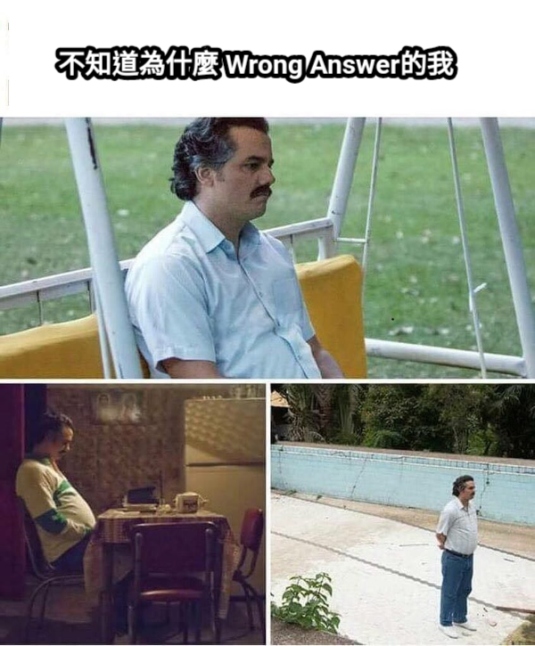
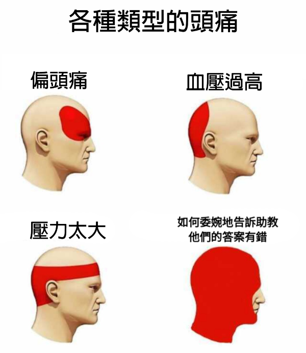
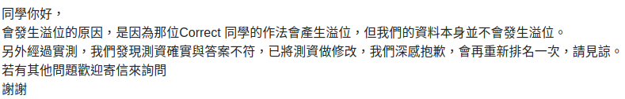
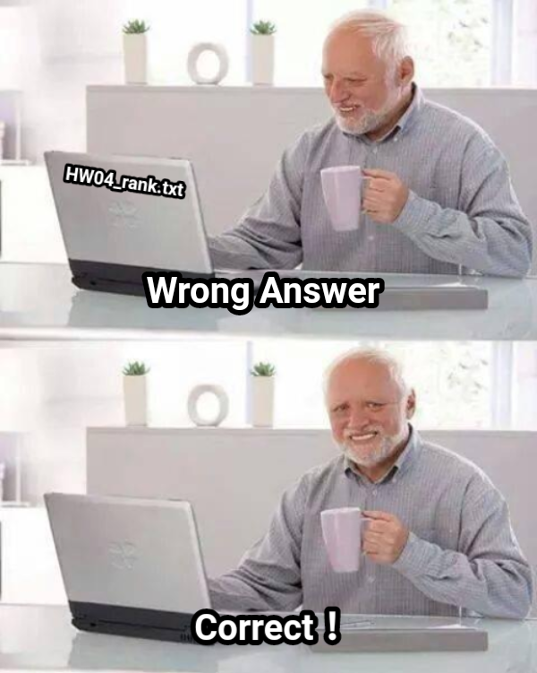

# PCL

給定一個 row:N, col:2 的 int陣列，每一個 row 代表一個點，col=0 表 x 值，col=1 表 y 值

這個 int 陣列是否存在三點共線

請實作 checkPCL()

```java
public abstract class PCL{
    public abstract boolean checkPCL(int[][] array);
}
```

## Wrong Answer

前幾天傳上去不斷的得到 wrong answer ，我跟 correct 的同學借程式碼來看基本上是這幾種

### 這樣才會 Correct 第一型 (根本沒轉型)

```java
public boolean checkPCL(int[] a){
    int len = a.length;
    for(int i=0; i<len; i++){
        for(int j=i+1; j<len; j++){
            for(int k=j+1; k<len; k++){
                if((a[i][0]-a[j][0]) / (a[i][1]-a[j][1]) == (a[j][0]-a[k][0]) / (a[j][1]-a[k][1])){
                    return true;
                }
            }
        }
    }
    return false;
}
```

相信聰明的朋友都看的出 int 除以 int 的下場了，結果這樣算還真讓他們 correct ，而且還超快，比如本來第1000筆才會共線，他們可能第10筆就共線了，就完全是運氣

順帶一題，後來抓了測資發現如果他們反過來用 y/x 就會 wrong answer

> 第一筆：(1,1) (2,2) (3,6)
>
> 第二筆：(3,3) (4,4) (5,9)

### 這樣才會 Correct 第二型 (溢位型)

```java
public boolean checkPCL(int[][] array){
    int i,j,k=0;
    int len = array.length;
    for(i=0; i<len; i++){
        for(j=i+1; j<len; j++){
            for(k=j+1; k<len; k++){
                // 利用國中學的任意凸多邊型面積公式 (俗稱划船公式)
                // | x1 x2 x3 x1 |
                // | y1 y2 y3 y1 |
                int x1 = array[i][0];
                int y1 = array[i][1];
                int x2 = array[j][0];
                int y2 = array[j][1];
                int x3 = array[k][0];
                int y3 = array[k][1];
                if((x1*y2 + x2*y3 + x3*y1 - y1*x2 - y2*x3 - y3*x1) == 0){
                    return true;
                }
            }
        }
    }
    return false;
}
```

這個方法用[助教給的測資](default_test_data.txt)很快就可以看出端倪，如果x1或y1都大於 65536 (2^16)，相乘馬上就溢位了，而且溢的剛剛好，跟上一種方法一樣比如正確答案在第 1000 筆共線，用這種方法可能第 100 筆就共線了

助教給的測資實際上只有一組有共線，如果你要檢測自己有沒有錯，你可以直接把答案印出來去 [geogebra](https://www.geogebra.org/?lang=zh-TW) 上跑跑看，當時借了好幾個 correct 的人的程式 ，結果被我測都是唬爛程式



現在真相越來越清礎了，要怎麼告訴助教才能避免他的的玻璃心呢？



後來在 4/19(日) 揪了3,4個人去寄信


> 真理越辯越明



## 正確做法......嗎？

Hash Map 自己實作 OK 吧，上一次作業早就該會了，該來的還是會來

```java
public boolean checkPCL(int[][] array){
    int i,j;
    int len = array.length;
    int hashCap = 1 << ((int)Math.ceil(Math.log10((double)len) / 0.3010));
    HashMap m = new HashMap(hashCap);
    for(i=0; i<len; i++){
        for(j=i+1; j<len; j++){
            if(m.containOrPut((double)(array[i][1] - array[j][1]) / (double)(array[i][0] - array[j][0]))){
                return true;
            }
        }
        m.reset();
    }
    return false;
}
```

(本做法不考慮重複點的可能)

> __還不夠快？__
>
> 如果覺得還不夠快，可以切割成 32 份，用改分伺服器的 32 個執行緒幫你跑

## 爭議

為什麼不印出有幾筆三點共線就好了呢？就算要用 boolean 值，也應該設計聰明一點的測資吧...，算了不知道這次又是從哪抓來的 data

---

因為這一次都在心煩 wrong answer 的事，無心加速

| 排名  | 檔名          | 時間       |
|:---:|:-------------:|:--------:|
| 0   | PCL4107056011 | 0.033109 |
| 1   | PCL4106061131 | 0.652694 |
| 2   | PCL4107056002 | 0.655956 |
| __3__   | __PCL4107056019__ | __0.780628__ |
| 4   | PCL4107056006 | 0.873215 |
| 5   | PCL4107056004 | 0.955093 |
| 6   | PCL4107056005 | 1.398048 |
| 7   | PCL4107056040 | 1.619786 |
| 8   | PCL4106053139 | 1.950350 |
| 9   | PCL4106053040 | 1.983346 |

那個第 0 名，這個速度很明顯是用猜的吧？第 1 名不知道怎麼做的也是挺猛的，第 2 名，第 4 名都我們這幫人，做法差不多速度當然也差不多

順便附上[測資生成器](testDataGenerator.R)

## 後記

**其實用 double 還是不夠嚴謹**

```java
long num1 = 189096792L;
long num2 = 1890228383L;
long num3 = 183414967L;
long num4 = 1833432354L;
System.out.println(num1 * num4);
System.out.println(num2 * num3);
System.out.println((double)(num1) / (double)(num2) == (double)(num3) / (double)(num4));
/*
    Result:
    346696176490408368
    346696176490408361
    true
*/
```

這是一個來自李同學的發現，因為精準度不夠所以 double 還是不夠準，其實這題我有實作另一個版本


△ 真不敢相信

## 真 ● 正確作法

直拉把斜率算成分數型用「整數分子、整數分母」當 key 存在 hashMap 裡面

```java
public boolean checkPCL(int[][] array){
    int i,j;
    int len = array.length;
    int lnLen = (int)Math.ceil(Math.log10((double)len) / 0.3010);
    HashMap m = new HashMap(1 << lnLen);

    int deltaX, deltaY,gcd;
    for(i=0; i<len; i++){
        for(j=i+1; j<len; j++){
            deltaX = array[i][0] - array[j][0];
            deltaY = array[i][1] - array[j][1];

            //If there is duplicate test data return true
            //if(deltaX == 0 && deltaY == 0) return true;

            gcd = gcd(deltaY, deltaX);

            //If Both deltaX and deltaY are positive or negative
            //Than deltaX/gcd and deltaY are positive

            //If one of deltaX and deltaY is positive and the other is negative
            //Than one of deltaX/gcd and deltaY/gcd is positive and the other is negative
            //However, we don't know which one is positive or which one is negative
            //Thus, we will keep deltaX is positive and deltaY is negative
            //By changing their signed.

            deltaX = (deltaX / gcd);
            deltaY = (deltaY / gcd);
            if(deltaX < 0){
                deltaX = ~deltaX + 1;
                deltaY = ~deltaY + 1;
            }

            //containOrPut()
            //If the values has existed, return true
            //Else put into hashmap and return false
            if(m.containOrPut(deltaX, deltaY)){
                return true;
            }
        }
        m.reset();
    }

    return false;
}
```
(本做法不考慮重複點的可能，已註解掉)
