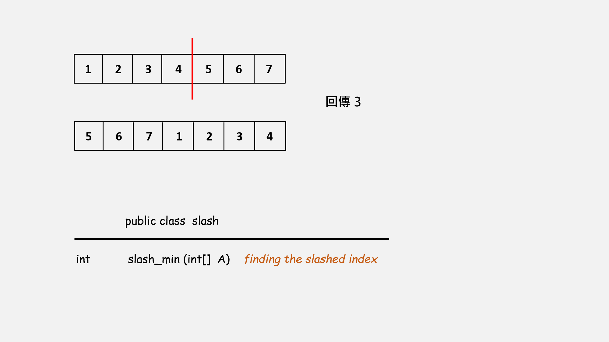

# Slash

給定一個陣列這個陣列是由一個遞增數列重新組成而成

比如原先是 [1,4,6,7,8,9,10]

接著我們從 4, 6 中切一刀 [1,4 | 6,7,8,9,10]

[6,7,8,9,10,1,4]

這個陣列就是題目給的測資

必需回推原本是從哪裡切的 (切下去的左邊元素的index)，以這個例子為例就是 1

---

教授給的例子



這題其實很簡單，沒有什麼難度可言，最差的情況也有 O(logN)

## 思路

我們可以思考要怎麼找到最小值找到最小值的 index 稍微用國小數學推算一下就可以算回切下去的位置

我們先把陣列分成兩個部份

原：[1,4 | 6,7,8,9,10]

新：[6,7,8,9,10 | 1, 4]

partA | partB

partA 就是原先陣列被刀子切下的右邊
partB 就是原先陣列被刀子切下的左邊

首先先取中位數

如果中位數比左邊開頭大很明顯就是 partA 所以我們下次要找的地方就變成 「中位數 \~ 結尾」，否則就是 partB 所以我們下次要找的地方就變成 「開頭 \~ 中位數」

然後一直遞迴，這樣講好像有點抽像，直接給程式碼你們就會懂了

```java
public int slash_min(int[] A){
    int start = 0;
    int end   = A.length - 1;
    if(A[start] < A[end]) return -1;
    for(int mid = (start+end) >> 1; mid!=start; mid = (start+end) >> 1){
        if(A[mid] > A[start]){
            start = mid;
        }else{
            end = mid;
        }
    }
    return A.length - end - 1;
}
```
