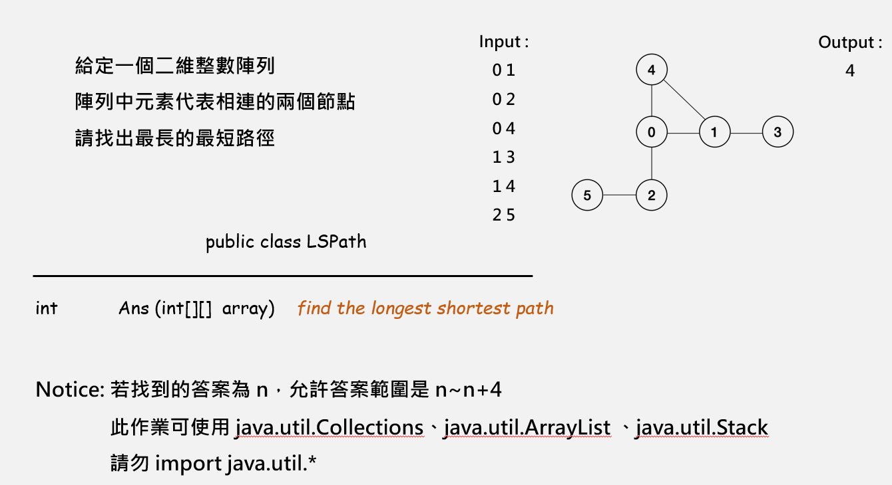

# LSPath

>
> 給定一個 int 二維陣列，陣列中包含圖的所有邊 (x, y)，尋找圖上「所有點到點的最短路徑中」，最長的那條，並回傳其長度
>
> 回傳值 n 代表你找的答案在 n~n+4 區間 i.e. 你可以找的偏短，但不能偏長
>



## 來自計網的啟發

同為這學習必修的計算機網路裡面有一張圖是在說明網路的架構，其中從那張圖可以看出邊緣端設備到下一個邊緣端設備的距離最遠

__想法一__

從我心中擁上的第一個想法就是在做 adjacency list 時，順便記錄各點的 degree 並從那些 degree 只有一的的點進行走訪

缺點：若沒有 degree 為一的點會很難處理

__想法二__

從 degree 最高的點做 BFS 到邊緣點，再對所有邊緣端做 BFS 找出最遠的點，即可找到最長距離

缺點：邊緣點太多，雖然答案會很接近，但效能無法提升

__想法三__

從 degree 最高的點用 BFS 找離這個點最遠的點，然後直接以找到的那個點做 BFS 找最遠的點，此點到彼點的距離即為最長距離

缺點：僅以單一的點來做尋找，有點偏賭博

__最終決定__

試過多種方法後，直接以 __想法三__ 實作經過幾天的測試後都能 correct 且效能快到爆

## 實作困難

1. 不確定大小的數字

    > 1. 以大陣列做實作 → 偏慢
    > 2. 以 hashset 配合 adjacency list 來實作

2. 無佇列套件可以引用 (BFS需要)

    > 1. 以 java 套件 arraylist 實作 → 偏慢
    >
    > 2. 以 linked list 實作 → 偏慢
    >
    > 3. 以可擴容陣列實作 → 快，但不夠快
    >
    > 4. 以靜態陣列實作 → 極速 (長度設為所有結點的點數)


## 警告
>
> __本範例使用大量混合資料結構__，而且 __因為效能問題__ ，所以都是很古怪的結構，建議各位自己實作
>
> 腦波低弱時可移駕至 [@wei_coding](https://github.com/wei-coding/Algorithm/tree/master/hw07), [@YuTing-Fang1999](https://github.com/YuTing-Fang1999/Algorithms-Java/tree/master/hw07_LSPath), [@tomy0000000](https://github.com/tomy0000000/NCHU-Algorithms/tree/master/Homework%207)
>

## 實作


### STEP 0 主程式碼

```java
public int Ans(int[][] array){
    // 初始化 Graph 容量為陣列長度 + 1
    Graph g = new Graph(array.length + 1);

    // 將陣列一一放入，其實照理來說可以並入上一步
    // 在宣告時就先放入但我那時沒想那麼多
    for(int[] v: array){
        g.append(v[0], v[1]);
    }

    // 這裡的 -2 並不是為了要湊題目誤差什麼
    // 只是單純在計算時會多算 2 層，所以要扣回去
    return g.findMaxDepth()-2;
}
```

### STEP1 實作 Graph 以建立 Adjacency list

```java
class Graph{
    private HashAdjList adjList;    // 準備製作 adjacency list
    private FiniteQueue queue;      // BFS 做準備
    private int maxDepth;           // 那個離中心(degree 最大的點)最遠的點的距離
    private int maxDepthNode;       // 那個離中心(degree 最大的點)最遠的點的記號
    private int len;                // 邊的總數 (一般是用 E，但我當時想用 len)

    Graph(int len){
        // 進行一些初始化
        this.len = len;
        this.maxDepth = 0;
        // 因為 Vertex 個數不明所以直接抓 Edge * 2
        adjList = new HashAdjList(len << 1);
        queue = new FiniteQueue(len);
    }

    // 用他來加入新的邊(無向) 所以兩個方向都要加
    final void append(int a, int b){
        adjList.put(a, b);
        adjList.put(b, a);
    }

    // 尋找離最遠中心點(a.k.a degree 最大的點)最深的點
    // 然後從那點出發找離那點最遠的距離
    final int findMaxDepth(){
        // 從中心點(a.k.a degree 最大的點)做 BFS
        BFSmark(adjList.maxDegreeNode);
        // 從「離中心點最遠的點」做 BFS
        BFSmark(this.maxDepthNode);
        return this.maxDepth;
    }

    // 該 BFSmark 改良自一般的 BFS
    // 除了做圖的遍歷之外，另外還會標記深度
    final void BFSmark(int a){
        Set depth = new Set(this.len);

        depth.put(a, 1);
        //FiniteQueue has been initialized when Graph() was constructed
        queue.enqueue(a);

        while(!queue.empty()){
            a = queue.dequeue();
            int self_depth = depth.get(a) + 1;
            if(self_depth > maxDepth){
                maxDepth = self_depth;
                maxDepthNode = a;
            }

            // 這裡我後來想了很久
            // 簡單來說我的 Adjlist 是由 hashset + arraylist 合成的
            // 現在在做的就是「把相鄰點找出來然後加入佇列」
            // ArrayListLite 的 "Lite" 就是為了效能所以做的更輕量化
            ArrayListLite arr = adjList.get(a);
            for(arr.read(); arr.hasNext();){
                int n = arr.next();
                if(!depth.contain(n)){
                    depth.put(n, self_depth);
                    queue.enqueue(n);
                }
            }
        }
    }
}
```
### STEP 2, 3, 4, 5 實作其他資料結構

```java
class HashAdjList{}   // 集合，但是是放 adjacency list 的
class Set{}           // 實作集合
class FiniteQueue{}   // 實作不可擴容靜態佇列
class ArrayListLite{} // 實作輕量級 arraylist
```

## 結果

從頭到尾自己實作成績果然亮眼

<center>

|Rank |   ID              |        Time    |
|-----|-------------------|----------------|
| __0__ | __LSPath4107056019__  | __time: 0.025050__ |
|  1  | LSPath4107056008  | time: 0.029754 |
|  2  | [LSPath4107056005](https://github.com/YuTing-Fang1999/Algorithms-Java/tree/master/hw07_LSPath)  | time: 0.033113 |
|  3  | LSPath4107056040  | time: 0.050886 |
|  4  | LSPath4105061037  | time: 0.052847 |
|  5  | LSPath4107056004  | time: 0.058710 |
|  6  | LSPath4107065004  | time: 0.074730 |
|  7  | LSPath4107056027  | time: 0.092673 |
|  8  | [LSPath4107056042](https://github.com/tomy0000000/NCHU-Algorithms/tree/master/Homework%207)  | time: 0.092685 |
|  9  | LSPath4105062052  | time: 0.098200 |

</center>
