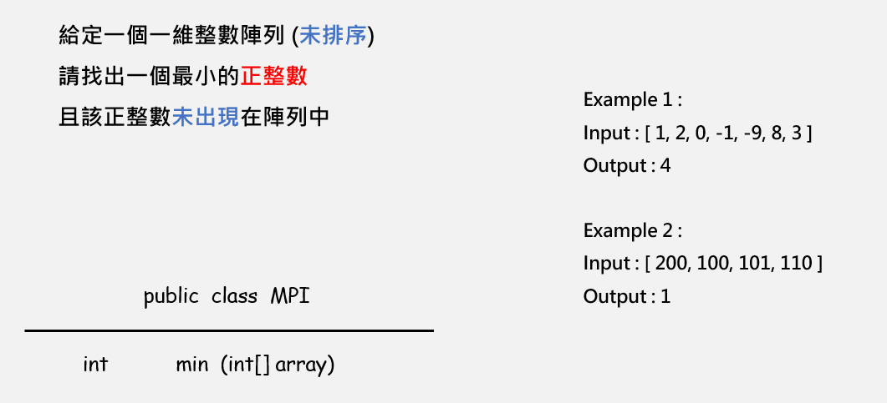
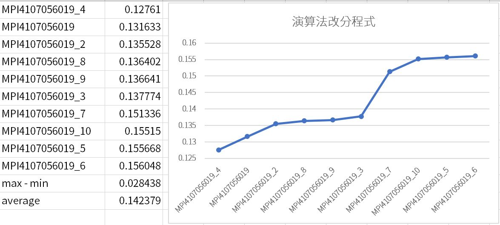

# MPI



Question:

> Find a minimum number k which is not in the unsorted int array and not in continuous array 1~k-1.
>

## Brute force (Trash)
Sorting (nlogn) + linear traversal (n)

## Mark (Trash)
Declare a big boolean array and mark the integer which is in int array.

pros. Very simple. Time complexity is only O(n)

cons. You should know the maximum number in int array. However, in actually, you can declare a boolean array whose length is the length of int array. Because the answer cannot exceed the length of int array plus one. e.g.

>
> [1]   ans = 2
>
> [1,2] ans = 3
>
> [1,2,3] ans = 4
>

```java
public int min(int[] array){
    int len = array.length;
    int upperBound = len;
    //If array = 1,2,3,4,5
    //We need A = 0,1,2,3,4,5,6 (len+2)
    boolean A[] = new boolean[upperBound+2];
    int ans = 1;

    for(int i : array){
        if(i < ans || i > upperBound){
            upperBound--;
            continue;
        }

        A[i] = true;
        while(A[ans++]);
        ans--;
    }

    return ans;
}
```

## Smart Mark (Trash)
A boolean takes a byte memory, not a bit. Can we use just "a bit" to record which number is in int array?

Yes! We can use another int array to record. Because an integer is consisted of 2^32 bits, we can use just one integer to record 32 numbers.

e.g.

>
> [1]
>
> 0000 0000 0000 0000 0000 0000 0000 0011b
>
> [1, 3, 4]
>
> 0000 0000 0000 0000 0000 0000 0001 1011b
>
> [1, 3, 4, 7]
>
> 0000 0000 0000 0000 0000 0000 1001 1011b
>

We use `long` instead `int` because a long integer can record 64 numbers.

```java
public int min(int[] array){
    int len = array.length;

    // Smart way to declare long int
    long[] A = new long[(len >> 6) + 2];

    // We want to neglect 0 (so set the rightest bit to 1)
    A[0] = 1L;

    // Traversal
    for(int i : array){
        // If the number less than zero or bigger than len, neglect
        if(i < 0 || i > len) continue;

        // Else, record to A[] (By bit opration)
        // i & 63 means i % 64 (In order to get how many times we need to left shift 1)
        A[i >> 6] |= (1L << (i & 63));
    }

    // Fast check: if there are 111...1 in A[]
    int index = -1;
    while(A[++index] == -1L);

    // Slow check: check an element which is not 111...1 in A[]
    // We will optimize this way by binary search in another demo
    int ans = index << 6; // means index * 64

    // Check form least significant bit to most significant bit
    while((A[index] & 1) == 1){
        A[index] >>>= 1;
        ans++;
    }

    return ans;
}
```

## Rank
Very Bad

|Rank |   ID          |        Time    |
|-----|---------------|----------------|
|  0  | MPI7108056029 | time: 0.093752 |
|  1  | MPI4107056025 | time: 0.098827 |
|  2  | MPI4107056042 | time: 0.101804 |
|  3  | MPI4107056011 | time: 0.102443 |
|  4  | MPI4107056015 | time: 0.102831 |
| ... |       ...     |      ...       |
| __28__  | __MPI4107056019__ | __time: 0.122287__ |

## Dispute

Ten same programs get ten different score.



max - min = 28ms

I think the score program was completely unfair.

I know my algorithm was bad, but the score program was unfair too. In the result, I didn't know what is my "real" rank. It is a mystery forever.
