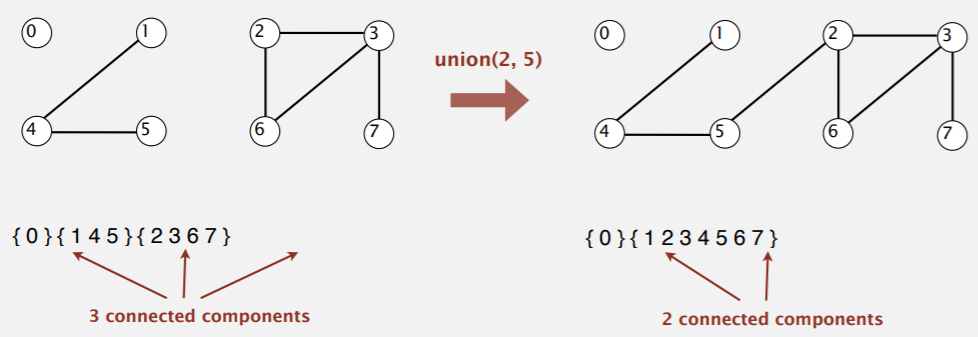
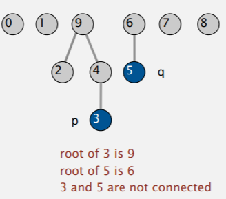
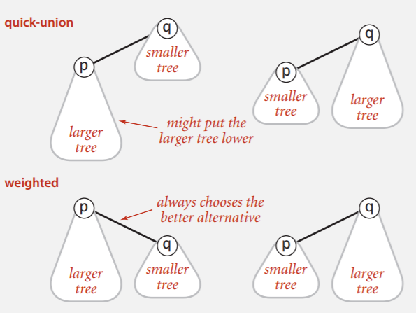
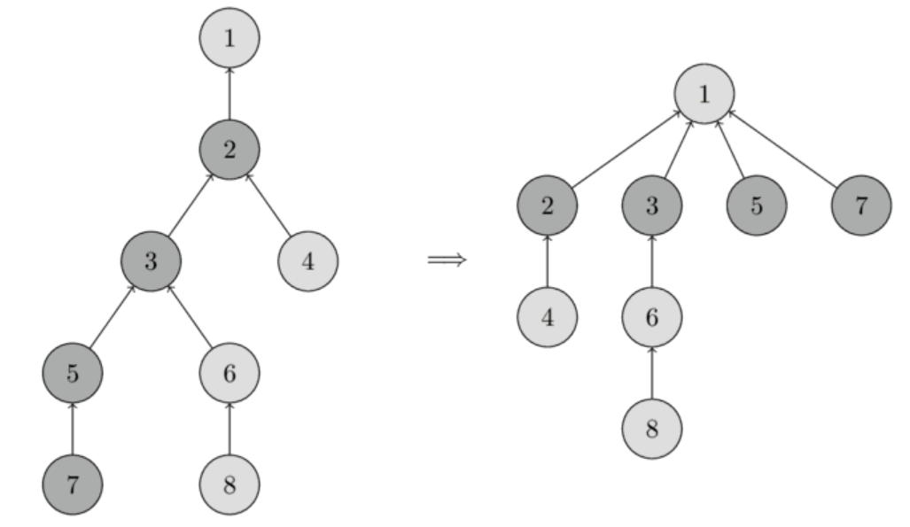

# Union Find

## 1. Quick Find



在 union 時把內部的 id 都換掉

```java
/*initialize union-find data structure with N singleton objects*/
public class UF(int N){
    // add connection between p and q
    union(int p, int q);
    // component identifier for p (get id of p)
    find(int p);
    // Are p and q in the same component?
    connected(int p, int q)  
}
```

缺點：Union時必需掃瞄所有 Array 很花時間

+ initialize O(N)

+ union O(N)

+ find O(1)

+ connected O(1)

#### Implementation

```java
public class QuickFindUF{
    private int[] id;

    public void QuickFindUF(int n){
        id = new int[n];
        for(int i=0; i<n; i++){
            id[i] = i;
        }
    }
    public int find(int p){
        return id[p];
    }
    public void union(int p, int q){
        int pid = id[p];
        int qid = id[q];
        //這就是比較慢的地方
        for(int i=0; i<id.length; i++){
            if(id[i] == pid){
                id[i] = qid;
            }
        }
    }
}
```

## 2. Quick Union

為了改善前一程式碼的 union 這次我們 union 只改最上面的 id ，不像上一個 Quick Find 把所有子樹的 id 都給改了，但也因此造成搜尋時會比較費時



| 0   | 1   | 2   | 3   | 4   | 5   | 6   | 7   | 8   | 9   |
|:---:|:---:|:---:|:---:|:---:|:---:|:---:|:---:|:---:|:---:|
| 0   | 1   | 9   | 4   | 9   | 6   | 6   | 7   | 8   | 9   |

#### Implementation

```java
public class QuickUnionUF{
    private int[] id;

    public void QuickFindUF(int n){
        id = new int[n];
        for(int i=0; i<n; i++){
            id[i] = i;
        }
    }

    public int find(int i){    //Find root

        while(i != id[i]){
            i = id[i];
        }
        return i;
    }

    public void union(int p, int q){    
        //把 p 的 root 的 id 改成 q 的 root

        int proot = fine(p);
        int qroot = fine(q);
        id[proot] = qroot;
    }
}
```

#### Comparison

| algorithm   | initialize | union          | find           | connected      |
|:-----------:|:----------:|:--------------:|:--------------:|:--------------:|
| quick-find  | O(N)       | O(N)           | O(1)           | O(1)           |
| quick-union | O(N)       | O(Tree Height) | O(Tree Height) | O(Tree Height) |

quick-union 在最差的情況下(Tree Height = N)會比 quick-find 差許多

## 3. Weighted Quick Union

為了不讓樹變高，我們多花一個空間記錄樹的大小，讓較小的樹的併到較大的樹才不會導致樹高一直變大



#### Comparison

| algorithm   | initialize | union            | find           | connected      |
|:-----------:|:----------:|:----------------:|:--------------:|:--------------:|
| quick-find  | O(N)       | O(N)             | O(1)           | O(1)           |
| quick-union | O(N)       | O(Tree Height\*) | O(Tree Height) | O(Tree Height) |
| weighted-QU | O(N)       | O(lg N\*)        | O(lg N)        | O(lg N)        |

\* means including cost of finding roots

lg means $log_2$

## 4. Path compression

#### Original

```java
public int find(int i){
    while(i!=id[i]){
        i = id[i];
        return i;    
    }
}
```

#### New

```java
public int find(int i){
    while(i!=id[i]){
        id[i] = id[id[i]];
        i = id[i];
    }
    return i;
}
```

在 find 後可以加速

After find(3) find(5) find(7)

## Summary

| algorithm                      | worst-case time |
|:------------------------------:|:---------------:|
| quick-find                     | M N             |
| quick-union                    | M N             |
| weighted-QU                    | N + M lg N      |
| QU + path compression          | N + M lg N      |
| weighted QU + path compression | N + M lg* N     |

order of growth for M union-find operations on a set of N objects
