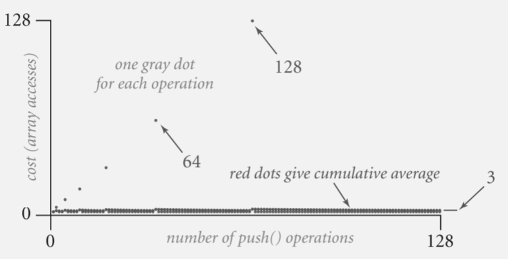

# Unknown Array Size Problem

**public class DoraemonBag**

|        |               |                                                  |
| ------ | ------------- | ------------------------------------------------ |
|        | DoraemonBag() | create an empty bag                              |
| void   | push(String)  | insert a new string onto bag                     |
| String | pop()         | remove and return the string most recently added |
| int    | size()        | number of strings on the can                     |

## Linked list implementation

```java
class DoraemonBag{
    public class DoraemonBag{
        private Node first = null;
        private class Node{
            String item;
            Node next;
        }
        public void push(String item){
            Node oldfirst = first;
            first = new Node();
            first.item = item;
            first.next = oldfirst;
        }
        public String pop(){
            String item = first.item;
            first = first.next;
            return item;
        }
    }
}
```

## Resizing-array implementation (Garbage)

```java
private String[] s;
private int N=0;

public DoraemonBag(){
    s = new String[1];
}

public void push(String item){
    if(N==s.length){
        resize(s.length+1);
    }
    s[N++] = item;
}

private void resize(int capacity){
    String[] copy = new String[capacity];
    for(int i=0; i<N; i++){
        copy[i] = s[i];
    }
    s = copy;
}
```

每次搬移都得複製前一次的陣列

> N + ( 2 + 4 + 6+ ... + 2(N-1))
> 
> N : 1 array access per push
> 
> 2(k-1) array accesses to expand to size k (ignoring cost to create new array)

**搬移時會花很多成本**

## Resizing-array implementation (Doubling size)

```java
public DoraemonBag{
    private String[] s;
    private int N = 0;

    public DoraemonBag(){
        s = new String[1];
    }    

    private void resize(int capacity){
        String[] copy = new String [capacity];
        for(int i=0; i<N; i++){
            copy[i] = s[i];
        }
        s = copy[i]
    }

    public void push(String item){
        if(N==s.length){
            resize(2 * s.length);
        }
    }

    public String pop(){
        String item = s[--N];
        s[N] = null;
        if(N>0 && N==s.length/4){
            resize(s.length/2);
        }
        return item;
    }
}
```

> N + (2+4+8+...+N) = N + (N\*2 - 1) 約 3N



## Amortized analysis

Starting from an empty data structure, average, running time per operation over a *worst-case* sequence of operations.

**Proposition.** Starting from an empty stack, any sequence of *N* push and pop operations takes proportional to *N*.

|           | Best | Worst | Amotized |
|:---------:|:----:|:-----:|:--------:|
| construct | 1    | 1     | 1        |
| push      | 1    | N     | 1        |
| pop       | 1    | N     | 1        |
| size      | 1    | 1     | 1        |

## Which one is better?

#### Linked-list implementation

+ Every operation takes constant time in the worst case.

+ Uses extra time and space to deal with the links.

#### Resizing-array implementation

+ Every operation takes constant amortized time.

+ Less wasted space.

---

## Memory analysis

### Primitive types

| type    | bytes |
|:-------:|:-----:|
| boolean | 1     |
| byte    | 1     |
| char    | 2     |
| int     | 4     |
| float   | 4     |
| long    | 8     |
| double  | 8     |

**Array overhead 24 bytes**

| type      | bytes   |
|:---------:|:-------:|
| char[N]   | 2N + 24 |
| int[N]    | 4N + 24 |
| double[N] | 8N + 24 |

**Object overhead. 16 bytes**

**Reference. 8 bytes**

**Padding. Each object uses a multiple of 8 bytes**
