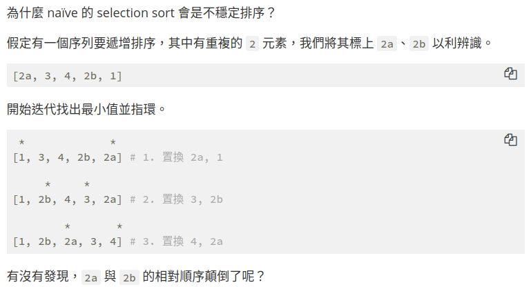
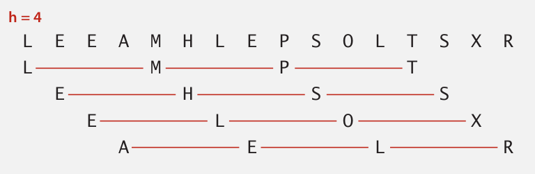

# Elementary Sort

## Selection sort

> i=0 \~ N
>
> 從 i 開始每次找剩餘陣列中最小的然後與之交換

```java
public class Selection{
    public static void sort(Comparable[] a){
        int N = a.length;
        for(int i=0; i<N; i++){
            int min = i;
            for(int j=j+1; j<N; j++){
                // 當a[j]比a[min]小時
                if(less(a[j], a[min])){
                    min = j;
                }
                swap(a, i, min);                
            }
        }
    }
}
```

compare: $(N-1) + (N-2) + ... + 1 + 0 \approx \frac{N^2}{2}$
exchages: $N$

**適用時機：適合排序搬移成本比較大的物件**

**優點：交換次數只要 N 次**

> selection sort 不是 stable
>
> 參考：[https://rust-algo.club/sorting/selection_sort/](https://rust-algo.club/sorting/selection_sort/)]
>
> 

## Insertion sort

> i=0 \~ N
>
> 拿著 i 一直往前比，如果 array[i] 比較小就交換

```java
public class Insertion{
    public static void sort(Comparable[] a){
        int N = a.length;
        for(int i=0; i<N; i++){
            for(int j=i; j>0; j--){
                // 當a[j]比a [j-1] 小時
                if(less(a[j], a[j-1])){
                    swap(a, j, j-1);
                }else{
                    break;
                }
            }
        }
    }
}
```

##### Best case:

If the array is in ascending order, insertion sort makes N-1 compares and 0 exchange.

##### Worst case:

If the array is in desending order (and no duplicates), insertion sort makes $\thicksim\frac{1}{2}N^2$ compares and $\thicksim \frac{1}{4}N^2$

**適用時機：適合排序搬移成本比較大的物件**

**優點：對快要排好的陣列，只需要線性時間**

---

## Implementing the Comparable interface

自己寫程式時很少會自己寫 sorting 通常都是拿 java 寫好優化的，要實現這件事必需使用 comparable

```java
//用comparable這個interface去交待系統怎麼排
public class Date impolements Comparable<Date>{
    private final int month, day, year;

    public Date(int m, int d, int t){
        month = m;
        day   = d;
        year  = y;
    }
    
    public int compareTo(Date that){
        if(this.year < that.year)   return -1;
        if(this.year > that.year)   return +1;
        if(this.month < that.month) return +1;
        if(this.day < that.day)     return -1;
        if(this.day > that.day)     return +1;
        return 0;
    }
}
```

這種功能叫作 callback = reference to executable code.

+ Client passes array of objects to sort() function.

+ The sort() function calls object's compareTo() method as needs.

implementing callbacks.

+ Java: interfaces.

+ C: function pointers.

+ C++: class-type functors.

+ C#: delegates.

+ Python, Perl, ML, Javascript: first-class functions.

## Shell sort

> 骨子裡就是 insertion sort
>
> **[Idea]** Move entries more than one position at time by h-sorting the array.



Shellsort. [Shell 1959] h-sort array for decreasing sequence of values of h.

```java
public class Shell{
    public static void sort(Comparable[] a){
        int N = a.length;
        int h = 1;
        while(h < N/3){
            h = h*3 + 1;    // 1, 4, 13, 40, ...
        }

        // h-sort the array
        while(h >= 1){
            for(int i=h; i<N; i++){
                //Insertion sort
                // 當a[j] 比a [j-h] 小時
                for(int j=i; j>=h && less(a[j], a[j-h]); j-=h){
                    swap(a, j, j-h);
                }
            }
            // move to next increment
            h /= 3;
        }
    }
}
```

> **說明：** 比如陣列長度有 40，就先做 40 sort，接著 13-sort ，4-sort，1-sort，sort 則是 insertion sort 為基礎
>
> **用途：** 排序測資較小的陣列，會比 quickSort, MergeSort 快，另一方面，如果要排序的硬體設備較差，也比較適合 shell sort，因為 QuickSort 和 MergeSort 需要用對遞迴，很吃硬體
>
> 常見如：手機聯絡人排序

| Algorithm       | best    | average | worst       |
|:---------------:|:-------:|:-------:|:-----------:|
| selection sort  | $N^2$   | $N^2$   | $N^2$       |
| insertion sort  | $N$     | $N^2$   | $N^2$       |
| Shellsort(3x+1) | $NlogN$ | ?       | $N^{(3/2)}$ |
| goal            | $N$     | $NlogN$ | $NlogN$     |

## Shuffling

### Knuth shuffle

In iteration **i**, pick integer **r** between **0** and **i** uniformly at random. Swap a[i] and a[r].

```java
public class StdRandom{
    public static void shuffle(Object[] a){
        int len = a.length;
        for(int i=0; i<len; i++){
            int r = StdRandom.unionfom(i);    //隨機選取選取 0 ~ i 間任意一數
            swap(a, i, r);
        }
    }
}
```
