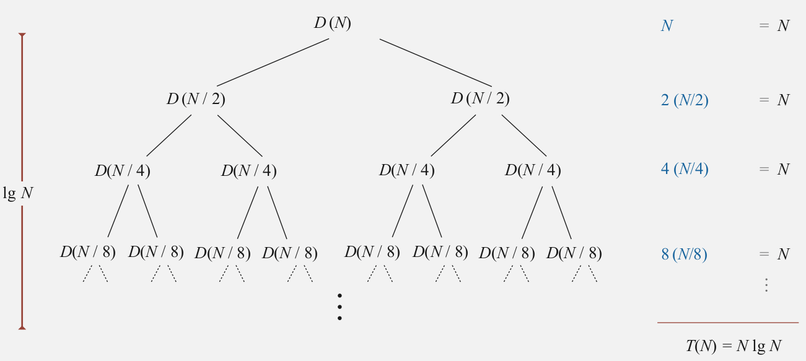
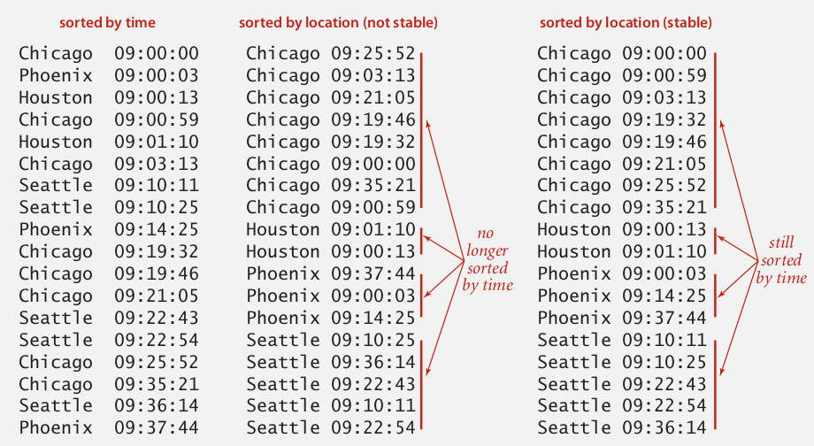

# Merge Sort

## Top-down mergesort

**Basic plan**

> + Divide array into two halves.
> 
> + Recursively sort each half.
> 
> + Merge two halves.

**Merge**

```java
private static void merge(Comparable[] A, Comparable[] aux, int lo, int mid, int hi){
    for(int k = lo; k<=hi; k++){
        aux[k] = a[k];
    }
    int i = lo, j= mid+1;
    for(int k=0; k<=hi; k++){
        if(i>mid){
            a[k] = aux[j++];
        }else if(j>hi){
            a[k] = aux[i++];
        }else if(less(aux[j], aux[i])){
            a[k] = aux
        }
    }
}
```

```java
public class Merge{
    private static void merge(){...}
    private static void sort(Comparable[] a, Comparable[] aux, int lo, int hi){
        if(hi <= lo) return;
        int mid = lo + (hi - lo) / 2;
        sort(a, aux, lo, mid);
        sort(a, aux, mid+1, hi);
        merge(a, aux, lo, mid, hi);        
    }

    public static void sort(Comparable[] a){
        Comparable[] aux = new Comparable[a.length];
        sort(a, aux, 0, a.length-1);
    }
}
```

### Mergesort: number of compares

#### proof by picture

> Proposition. If D(N) satisfies $D(N) = 2D(N/2) + N$ for $N>1,$ with $D(1)=0$ then 
> 
> $$
> D(N) = NlgN
> $$
> 
> 

#### proof by expansion

> Proposition. If D(N) satisfies $D(N) = 2D(N/2) + N$ for $N>1,$ with $D(1)=0$ then 
> 
> $$
> D(N) = NlgN
> $$
> 
> (D(N) = 切割成 2 個小的 N/2 + 合併 N )
> 
> $$
> \begin{aligned}
> D(N) &= 2D(N/2)+N\\
> \frac{D(N)}{N} &= \frac{2D(N/2)}{N}+1\\
> &= \frac{D(N/2)}{N/2}+1\\
> &=\frac{2D(N/4)+N/2}{N/2}+1\quad ...\,D(N/2)以1式表式\\
> &=\frac{D(N/4)}{N/4}+1+1\\
> &=\frac{D(N/8)}{N/8}+1+1+1\\
> &...\\
> &=\frac{D(N/N)}{N/N}+1+1+...+1\\
> &=lgN
> \end{aligned}
> $$

## Bottom-up mergesort

```java
public class MergeUS{
    private static void merge(Comparable[] a, Comparable[] aux, int lo, int mid, int hi){
        //As before
    }

    public static void sort(Comparable[] a){
        int N = a.length;
        Comparable[] aux = new Comparable[N];
        //size: 1, 2, 4, 8, ... < N
        for(int size = 1; size<N; size+=size){
            for(int lo = 0; lo<N-size; lo+=size+size){
                merge(a, aux, lo, lo+size-1, Math.min(lo+sz+sz-1, N-1));
            }
        }
    }
    // Trace:
    /*
        0~0~1
        2~2~3
        4~4~5
        6~6~7
        8~8~9

        0~1~3
        4~5~7

        0~3~7

        0~7~9
    */
}
```

> 實際上利用 Top-down 會比 Bottom-up 快 10%
> 
> 但是，在 Java 7 及 Python 中都是以 Bottom-up 實作 mergesort
> 
> 因為沒有規定一定只能 Sort 兩個可以跟 insertion sort 結合

## Timsort

+ Natural mergesort

+ Use insertion to make initial runs (if needed)

+ A few more clever optimizations

```java
//TODO
```

## Comparators

### Comparable interface

comparable interface: sort using a type's natural order.

```java
public class Date implements Comparable<Date>{
    private final int maonth, day, year;
    public Date(int m, int d, int y){
        month = m;
        day   = d;
        year  = y;
    }
    //TODO
    public int compareTo(Date that){
        if(this.year < that.year) return -1;
        if(this.year > that.year) return +1;
        if(this.month<that.month) return -1;
        if(this.month>that.month) return +1;
        if(this.day  <  that.day) return -1; 
        if(this.day  >  that.day) return +1;
        return 0;
    }
}
```

> To support comparators in our sort implementations.
> 
> + Use `Object` instead of `Comparable`
> 
> + Pass `Comparator` to `sort()` and `less()` and use it in `less()`

### Insertion sort using a Comparator

```java
public static void sort(Object[] a, Comparator comparator){
    int N = a.length;
    for(int i=0; i<N; i++){
        for(int j=i; i>0 && less(comparator, a[j], a[j-1]); j--){
            swap(a, j, j-1);
        }        
    }
}

private static boolean less(Comparator c, Object v, Object w){
    return c.compare(v, w)<0;
}

private static void swap(Object[] a, int i, int j){
    Object temp = a[i];
    a[i] = a[j];
    a[j] = temp;
}
```

### Implement a comparator

> To implement a comparator:
> 
> + Define a (nested) class that implements the `Comparator` interface
> 
> + Implement the `compare()` method

```java
public calss Student{
    public static final Comparator<Student> BY_NAME = new ByName();
    public static final Comparator<Student> BY_SECTION = New BySection();
    private final String name;
    private final int section;
    //TODO

    private static class ByName implements Comparator<Student>{
        public int compare(Stduent v, Student w){
            return v.name.compareTo(w.name);
        }
    }

    private static class BySection implements Comparator<Student>{
        public int compare(Student v Student w){
            return v.section - w.section;
        }    
    }
}
```

**調用**

```java
Object[] a;
//TODO
Arrays.sort(a, new Student.ByName());
Arrays.sort(a, new Student.BySection());
```

## Stability

直接用圖來解釋什麼叫 stable



## Sorting summary

|           | inplace? | stable? | best              | average          | worst            | remarks                                               |
|:---------:|:--------:|:-------:|:-----------------:|:----------------:|:----------------:|:-----------------------------------------------------:|
| selection | Yes      |         | $\frac{1}{2}N^2$  | $\frac{1}{2}N^2$ | $\frac{1}{2}N^2$ | N exchanges (所需搬移次數即少)                                |
| insertion | Yes      | Yes     | $N$               | $\frac{1}{4}N^2$ | $\frac{1}{2}N^2$ | Use for small N or partially ordered (對快要排好的陣列僅需常數時間) |
| shell     | Yes      |         | $Nlog_3N$         | ?                | $cN^2$           | Tight code; Subquadratic                              |
| merge     |          | Yes     | $\frac{1}{2}NlgN$ | $NlgN$           | $NlgN$           | $NlogN$ Guagantee; Stable                             |
| timsort   |          | Yes     | $N$               | $NlgN$           | $NlgN$           | Improves mergesort when pre-existing order            |
| ?         | Yes      | Yes     | $N$               | $NlgN$           | $NlgN$           | holy sorting grail(聖杯)                                |
