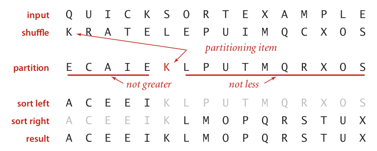
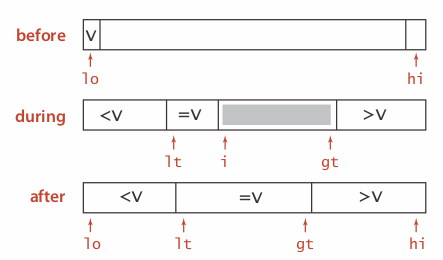

# Quick sort

> **Version1**
> 
> 新增一個新 Array 比我大的從 len-1 填，比我小的從 0 填
> 
> **Version2**
> 
> **Version3**

## Quick sort Ver3

### Quicksort partitioning demo



> Repeat until i and j pointers cross.
> 
> + Scan i from left to right so long as (a[i] **<=** a[lo]).
> 
> + Scan j from right to left so long as (a[j] **>=** a[lo]).
> 
> + Exchange a[i] with a[j]
> 
> When pointers cross. 
> 
> + Exchange a[lo] with a[j]
> 
> > 為什麼要弄小於**等於**，大於**等於**？這樣不是很脫褲子放屁嗎？
> > 
> > 不！如果不搬會導致很差的效率
> > 
> > 可以考慮以下例子
> > 
> > 3, 3, 3, 3, 3
> > 
> > 如果不加等號，那麼 i 跟 j 會一直 cross 一直跳出
> > 
> > 加了的話雖然比較常需要swap但效率仍比沒加高

### Implementation

```java
class QuickSort{
    private static int partition(Comparable[] a, int lo, int hi){

    }

    public static void sort(Comprable[] a){
        //先進行打散，避免 partition 出現極值
        //the importance of Knuth Shuffling
        nshuffle(a);
        sort(a, 0 , a.length-1);
    }

    private static void sort(Comparable[] a, int lo, int hi){
        if(hi <= lo){
            return;
        }
        int j = partition(a, lo, hi);
        sort(a, lo, j-1);
        sort(a, j+1, hi);
    }

    // Knuth Shuffling
    private static void shuffle(Comparable[] a){
        int len = a.length;
        for(int i=0; i<len; i++){
           int r = StdRandom.unionfom(i); //隨機選取選取 0 ~ i 間任意一數
           swap(a, i, r);
        }        
    }
}
```

### Average-case analysis

**Proposition.** The average number of compares $C_N$ to quicksort an array of N distinct keys is \~ $2NlnN$

Pf.

> $C_N$ staisfies the recurrence $C_0=C_1=0$ and for $N\ge 2$:
> 
> $$
> C_N = (N+1) + \frac{C_0+C_{N-1}}{N}+\frac{C_1+C_{N-2}}{N}+...+\frac{C_N-1+C_0}{N}
> $$
> 
> $$
> NC_N = N(N+1) + 2(C_0+C_1+...+C_{N-1}).....(1)
> $$
> 
> $$
> (N-1)C_{N-1} = N(N-1)+2(C_0+C_1+...+C_{N-2}).....(2)
> $$
> 
> $$
> (1)-(2)=> NC_N-(N-1)C_{N-1} = N(N+2) + 2C_{N-1}\\
> $$
> 
> $$
> NC_N = 2N+(N+1)C_{N-1}
> $$
> 
> $$
> C_N = \frac{N+1}{N}(C_{N-1})+2
> $$
> 
> $$
> \frac{C_N}{N+1} = \frac{1}{N}(C_{N-1})+\frac{2}{N+1}
> $$
> 
> $$
> C_{N-1}=\frac{N}{N-1}(C_{N-2})+2...代回上式
> $$
> 
> $$
> \frac{C_N}{N+1} = \frac{1}{N-1}(C_{N-3})+\frac{2}{N}+\frac{2}{N+1}
> $$
> 
> $$
> \frac{C_N}{N+1}=\frac1{N-2}(C_{N-4})+\frac{2}{N-1}+\frac{2}{N}+2
> $$
> 
> $$
> \frac{C_N}{N+1}=C_0+\frac{2}{3}+\frac{2}{4}+...+\frac{2}{N}+\frac{2}{N+1}

> $$
> 
> $$
> \begin{aligned}
C_N &= 2(N+1)\int_3^N\frac{1}{x}dx\\
&=2(N+1)\bigg(ln\,x\bigg|_3^N\bigg)\\
&=2(N+1)(lnN-ln3)\\
&\approx 2(N+1)(lnN)\\
\end{aligned}
> $$
> 
> $$
> lnN = log_eN = \frac{lg\,N}{lg\,e} = 0.693\,lg\,N
> $$
> 
> $$
> C_N \approx 2(N+1)(lnN) \approx 2NlnN = 1.39NlgN
> $$

+ Quick sort is a (Las vegas) randomized algorithm. (很像在賭博)

+ Guaranteed to be correct.

+ Running time depends on random shuffle.

Average case. Expected number of compares is \~$1.39NlogN$

+ 39% more compares than mergesort

+ Faster than mergesort in practice because of less data movement

Best case. Number of compares is \~ NlgN

Worst case. Number of compares is \~1/2NlgN

### Practical improvements (insertion for small subarray)

> Insertion sort small subarrays (小陣列改已 insertion sort 實作比較快)
> 
> + Even quicksort has too much overhead for tiny subarrays
> 
> + Cutoff to insertion sort for about 10 items

```java
private static void sort(Comparable[] a, int lo, int hi){
    if(hi <= lo + CUTOFF -1){    //  hi-lo+1 < CUTOFF
        Insertion.sort(a, lo, hi);
        return;        
    }
    int j = partition(a, lo, hi);
    sort(a, lo, j-1);
    sort(a, j+1, hi);
}
```

### Practical improvements (median of sample)

> + Best choice of pivot item = median
> 
> + Estimate true median by taking median of sample
> 
> + Median-of-3 (random) items

```java
private static void sort(Comparable[] a, int lo, int hi){
    if(hi<=lo) return;

    int median = midianOf3(a, lo, lo+(hi-lo)/2, hi);
    swap(a, lo, median);

    int j = partition(a, lo, hi);
    sort(a, lo, j-1);
    sort(a, j+1, hi);
}
```

## 3-way QuickSort

此版本 QuickSort 專門處理高重複值(duplicate Keys)的陣列

> Let v be partitioning item a[lo].
> 
> Scan i from left to right. (僅有一個 scanner)
> 
> + a[i] < v: exchange a[lt] with a[i]; increment both **lt** and **j**
> 
> + a[i) > v: exchange a[gt] with a[i]; decrement **gt**
> 
> + a[i] == v: increment **i**
> 
> 當 i 跟 gt 交換時就停下來



```java
private static void sort(Comparable[] a, int lo, int hi){
    if(hi<=lo) return;
    int lt = lo, gt = hi;
    Comparable v = a[lo];
    int i=lo;
    while(i<=gt){
        //a[i]與v做比較
        //a[i]>v 回傳 1
        //a[i]==v 回傳 0 
        //a[i]<v 回傳-1
        int cmp = a[i].compareTo(v);
        if     (cmp<0) swap(a, lt++, i++);    //比a[i]小從前面放
        else if(cmp>0) swap(a, i, gt--);    //比a[i]大從後面放
        else           i++;
    }

    sort(a, lo, lt-1);
    sort(a, gt+1, hi);
}
```

## Summary

|             | inplace? | stable? | best              | average          | worst            | remarks                                               |
|:-----------:|:--------:|:-------:|:-----------------:|:----------------:|:----------------:|:-----------------------------------------------------:|
| selection   | Yes      |         | $\frac{1}{2}N^2$  | $\frac{1}{2}N^2$ | $\frac{1}{2}N^2$ | N exchanges (所需搬移次數即少)                                |
| insertion   | Yes      | Yes     | $N$               | $\frac{1}{4}N^2$ | $\frac{1}{2}N^2$ | Use for small N or partially ordered (對快要排好的陣列僅需常數時間) |
| shell       | Yes      |         | $Nlog_3N$         | ?                | $cN^2$           | Tight code; Subquadratic                              |
| merge       |          | Yes     | $\frac{1}{2}NlgN$ | $NlgN$           | $NlgN$           | $NlogN$ Guagantee; Stable                             |
| timsort     |          | Yes     | $N$               | $NlgN$           | $NlgN$           | Improves mergesort when pre-existing order            |
| qucick      | Yes      |         | NlgN              | 2NlnN            | $\frac{1}{2}N^2$ | $NlogN$ probabilistic gurantee; fastest in practice   |
| 3-way quick | Yes      |         | N                 | 2NlnN            | $\frac12N^2$     | improves quicksort when duplicate keys                |
| ?           | Yes      | Yes     | $N$               | $NlgN$           | $NlgN$           | holy sorting grail(聖杯)                                |

Applications have diverse attributes.

+ Stable?

+ Parallel? 可以用 quicksort 和 mergesort

+ In- place?

+ Deterministic? 不可以有最差狀況出現比如quick sort 有機率出現 $1/2N^2$ Deterministic 是指在同樣輸出的情況下要有相同的答案，相同的效率

+ Duplicate keys?

+ Multiple key types?

+ Large or small items? Large item 可以善用 selection sort

+ Randomly-ordered array? 即將排序好時用 insertion sort 比較快

+ Guaranteed performance? 比如股票系統不可以有 $1/2N^2$ 的情況產生(不可以有太低效能)

## Quick - Selection

> **Goal:** Given an array of N items, find the k<sup>th</sup> smallest item.
> 
> Ex. Min (k = 0), max (k = N - 1), median (k = N / 2).

**Implementation**

```java
public class Comparable select(Comparable[] a, int k){
    StdRandom.shuffle(a);
    int lo = 0, hi = a.length-1;
    while(hi>lo){
        int j = partition(a, lo, hi);
        if(j<k)      lo = j+1; //在右半邊 j+1 ~ hi
        else if(j>k) hi = j-1; //在左半邊 lo ~ j-1
        else         return a[k];       
    }
    return a[k];
}
```

### Analysis

> Quick-select takes liner time on average.

Each partitioning step splits array approximately in half:

> $N + N/2 + N/4 + ...+ 1\approx 2N$
