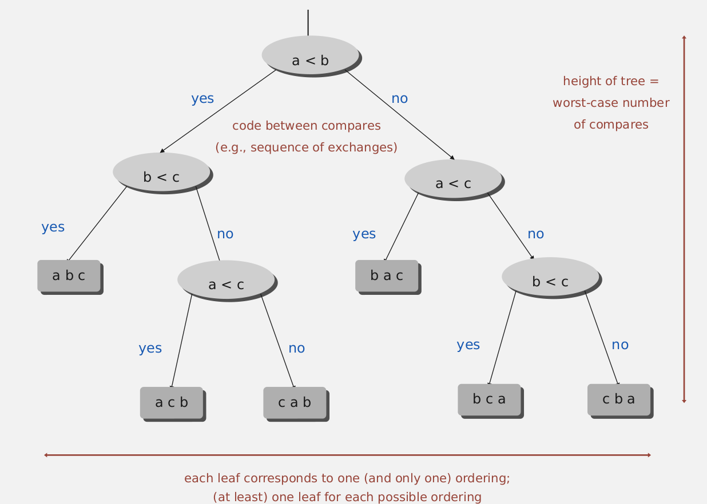
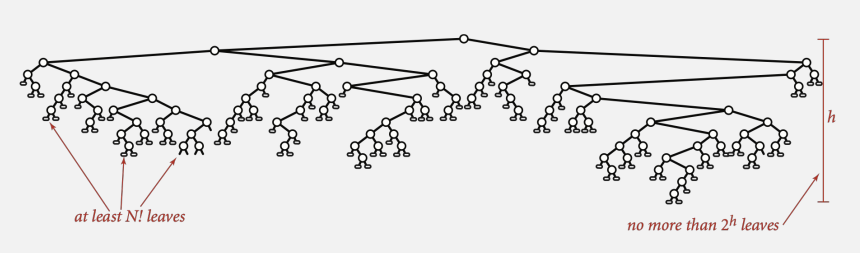
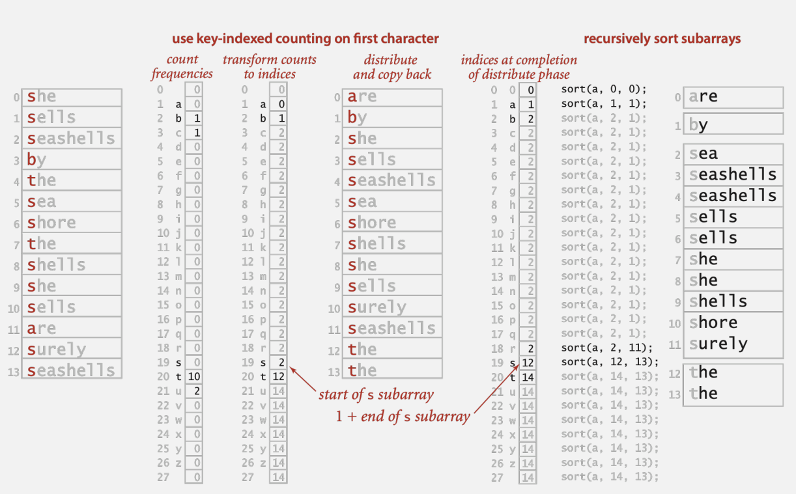

# Counting Sort

## Complexity of sorting

+ Computational complexity. Framework to study efficiency of algorithms for solving a particular problem x.

+ Model of computation. Allowable operations.

+ Cost model. Operation count(s)

+ Upper bound. Cost guarantee provided by some algorithm for X.

+ Lower bound. Proven limit on cost guarantee of all algorithm for X.

> Example: sorting
> 
> + Model of computation: decision tree.(決策樹)
> 
> + Cost model: #compares
> 
> + Upper bound: \~ NlgN from mergesort
> 
> + Lower bound: ? (使用決策樹做證明)
> 
> + Optimal algorithm

決策樹



> Proposition. Any compare-based sorting algorithm must use at least lg(N!)\~NlgN compares in the worst-case
> 
> Pf.
> 
> + Assume array consists of N distinct values $a_1$ through $a_N$
> 
> + Worst case dictated by height _h_ of decision tree.
> 
> + Binary tree of height _h_ has at most $2^h$ leaves.
> 
> + $N!$ different orderings Þ at least $N!$ leaves.



$$
2^h ≥ \#leaves ≥ N !
$$

$$
h≥lg(N!)\approx NlgN
$$

Why $lg(N!)\approx NlgN$?

$$
ln(N!)=ln(N\times(N-1)\times(N-2)\times...\times1)
$$

$$
ln(N!) = ln(N)+ln(N-1)+ln(N-2)+...+ln2+ln1
$$

$$
ln(N!)=\int_0^Nln(x)dx
$$

by parts $\int udv = uv -\int vdu$

$$
let\quad u=ln(x)\\let\quad dv=dx\quad v=x\\
du/dx = dln(x)/dx\\
du/dx = \frac1x\\
du = \frac1xdx\\
\int ln(x)dx = ln(x)\cdot x-\int (x)\cdot(\frac1xdx)

$$

$$
\int ln(x)dx=xlnx-x
$$

$$
ln(N!)\approx\int_0^nln(x)dx = (xlnx-x)\bigg\vert _0^n=nln(n)-n
$$

$$
lg(N!) \approx n\,lg\,n
$$

### Key-indexed counting demo

> Goal. Sort an array a[] of N integers between 0 and R-1
> 
> + Count frequencies of each letter using key as index.
> 
> + Compute frequency cumulates which specify destinations.
> 
> + Access cumulates using key as index to move items.
> 
> + Copy back into original array.

```java
public class Counting{
    public static void sort(int[] a, int R){
        int N = a.length;
        int[] aux   = new int[N];
        int[] count = new int[R+1];

        //計算重複的數字個數
        for(int i=0; i<N; i++){
            count[a[i]+1]++;
        }

        //將 count[] 陣列轉成數字出現的範圍，類似累計
        for(int r=0; r<R; r++){
            count[r+1] += count[r];
        }

        for(int i=0; i<N; i++){
            aux[count[a[i]]++] = a[i];
        }

        for(int i=0; i<N; i++){
            a[i] = aux[i];
        }
    }
}
```

## LSD radix sort

**Least-significant-digit-first sort**

> + Consider characters from right to left
> 
> + Stably sort using d<sup>th</sup> character as the key (using key-indexed counting)

```java
public class LSD{
    public static void sort(String[] a, int W){
        int R = 256;
        int N = a.length;
        String[] aux = new String[N];
        //do key-indexed counting for each digit from right to left
        for(int d = W-1; d>=0; d--){
            int[] count = new int[R+1];
            // key-indexed counting
            // 計算有幾個index
            for(int i=0; i<N; i++){
                count[a[i].charAt(d)+1]++;
            }
            // 將個數轉換為新陣列上出現的位置            
            for(int r=0; r<R; r++){
                count[r+1] += count[r];
            }

            // 將 a[] 中的元素依據 count[] 塞入 aux[]
            for(int i=0; i<N; i++){
                aux[count[a[i].charAt(d)]++] = a[i];
            }

            / /將 aux[] 回傳到 a[] 
            for(int i=0; i<N; i++){
                a[i]=aux[i];
            }
        }
    }
}
```


### LSD string sort: correctness proof

> Proposition. LSD sort fixed-length strings in ascending order.
> 
> Pf.
> 
> Aftep pass i, strings are sorted by last i characters.
> 
> + If two strings differ on sort key, key-indexed sort puts them in proper relative order.
> 
> + If two strings agree on sort key, stability keeps them in proper relative order.
> 
> Proposition. **LDS sort is stable**
> 
> Pf. Key-indexed counting is stable

## MSD radix sort

> + Consider characters from left to right.
> 
> + Stably sort using d<sup>th</sup> character as the key (using key-indexed counting)
> 
> 實作
> 
> + Partition array into R pieces according to first character (use key-indexed counting)
> 
> + Recursively sort all strings that start with each character (key-indexed counts delinate(/dɪˈlɪn.i.eɪt/) subarray to sort)

```java
public static void sort(String[] a){
    String[] aux = new String[a.length];
    sort(a, aux, 0, a.length-1, 0);    
}

private static void sort(String[] a, String[] aux, int lo, int hi, int d){
    if(hi<=lo) return;
    int[] count = new int[R+2];
    // 計算有幾個index
    for(int i=lo; i<=hi; i++){
        count[charAt([a[i], d) + 2]++;
    }

    // 將個數轉換為新陣列上出現的位置
    for(int r=0; r<R+1; r++){
        count[r+1] += count[r];
    }

    // 將 a[] 中的元素依據 count[] 塞入 aux[]
    for(int i=lo; i<=hi; i++){
        aux[count[charAt(a[i], d) + 1]++] = a[i];
    }

    // 將 aux[] 回傳到 a[] 
    for(int i=lo; i<=hi; i++){
        a[i] = aux[i-lo];
    }

    // Sort R subarrays recursively
    for(int r=0; r<R; r++){
        sort(a, aux, lo+count[r], lo+count[r+1]-1, d+1);
        // d 代表算到第個字元了(原本是從 0 開始，漸漸往右移)
    }
}
```



## Summary

| Algorithm      | guarantee    | random       | extra space | stable? |
|:--------------:|:------------:|:------------:|:-----------:|:-------:|
| insertion sort | $\frac12N^2$ | $\frac14N^2$ | 1           | stable  |
| mergesort      | $NlgN$       | $NlgN$       | N           | stable  |
| quicksort      | $1.39NlgN$   | $1.39NlgN$   | 1           | no      |
| heapsort       | $2NlgN$      | $2NlgN$      | 1           | no      |
| LSD sort       | $2W(N+R)$    | $2W(N+R)$    | N + R       | stable  |
| MSD sort       | $2W(N+R)$    | $Nlog_RN$    | N + DR      | stable  |

> + N = length of array
> 
> + R = how many kind of elements
> 
> + W = fixed-length W strings
> 
> + The extra space of MSD sort is N+DR, D is function-call stack depth (length of longest prefix match)
