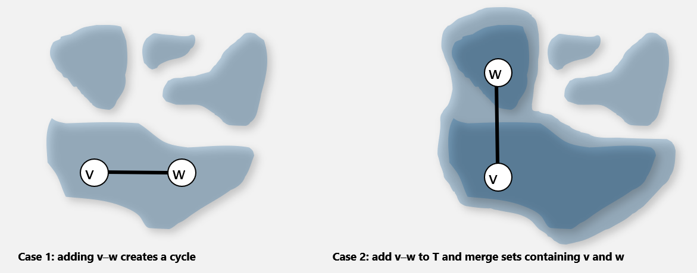
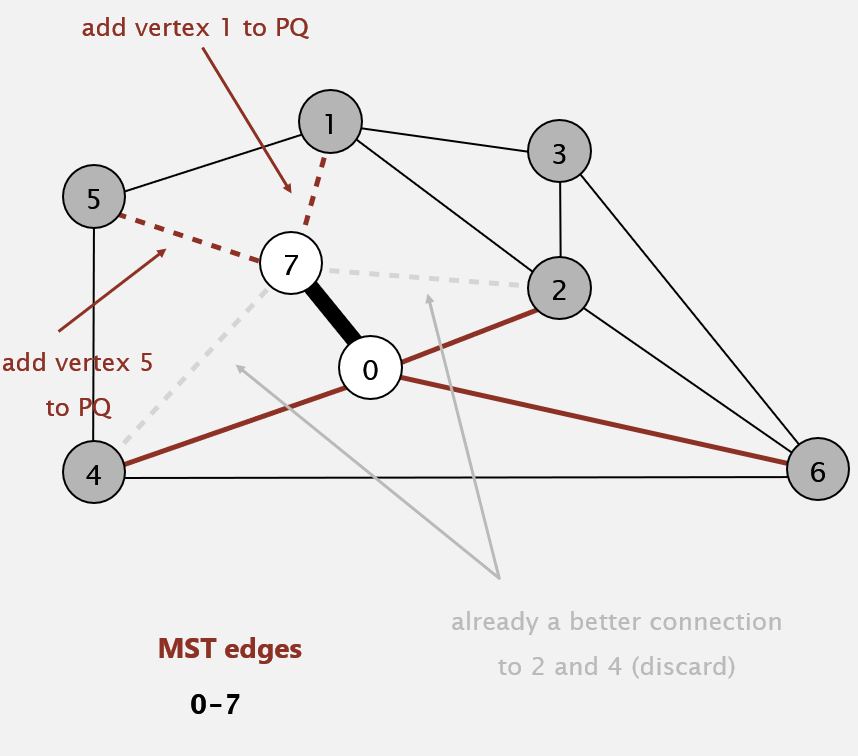

# Minimum Spanning Tree

## Edge-weighted graph API

```java
public class EdgeWeightedGraph{
    EdgeWeightedGraph(int v)    // Create empty graph with V vertices
    EdgeWeightedGraph(In in)    // Create a graph from input stream
    void addEdge(Edge e)        // Add weighted edge e to this graph
    Iterable<Edge> adj(int v)   // Edges incident to v
    Iterable<Edge> edges()      // All edges in this graph
    int V()                     // Number of vertices
    int E()                     // Number of edges
    String toString()           // String representation
}
```

**實作有權重邊的有向圖**

```java
public class EdgeWeightedGraph{
    private final int V;
    private final Bag<Edge>[] adj;

    // Constructor
    // Create empty graph with V vertices
    public EdgeWeightedGraph(int V){
        this.V = V;
        adj = (Bag<Edge>[]) new Bag[V];
        for(int v=0; v<V; v++){
            adj[v] = new Bag<Edge>();
        }
    }

    public void addEdge(Edge e){
        int v = e.either(), w = e.other(v);
        add[v].add(e);
        add[w].add(e);
    }

    public Iterable<Edge> adj(int v){
        return adj[v];
    }
}
```

**實作有權重的邊**

```java
public class Edge implements Comparable<Edge>{
    private final v, w;
    private final double weight;
    public Edge(int v, int w, double weight){
        this.v = v;
        this.w = w;
        this.weight = weight;
    }

    //either endpoint 取得該有向邊的起始點
    public int either(){
        return v;
    }

    //other endpoint
    //若參數 (vertex) 是 v 會得 w
    //若參數 (vertex) 是 w 則會得 v
    public int other(int vertex){
        if(vertex==v) return w;
        else return v;
    }

    public int compareTo(Edge that){
        if(this.weight < taht.weight) return -1;
        else if(this.weight > that.weight) return +1;
        else reutrn 0;
    }
}
```

## Minimum spanning tree

> **Def.** A spanning tree of G is a subgraph T that is:
> 
> 1. Connected (相連)
> 
> 2. Acyclic (無迴圈)
> 
> 3. Includes all of the vertices (包含所有圖形原有點)

## Kruskal's algorithm

> 1. 先把所有邊的集合按照權重由小到大排好
> 
> 2. 依序加入圖，若會產生迴圈則去掉這個邊

### Kruskal's algorithm: correctness proof

> **Proposition.** Kruskal's algorithm computes the MST.
> 
> **Pf.** Krukal's algorithm is a special case of the greedy MST algorithm.
> 
> + Suppose Kruskal's algorithm colors the edge *e* = *v* - *w* black.
> 
> + Cut = set of vertices connected to *v* in tree *T*.
> 
> + No crossing edge is black
> 
> + No crossing edge has lower weight.

### cut correctness proof

> Def. A `cut` in a graph is a partition of its vertices into two (nonempty) set.
> 
> Def. A `crossing edge` connects a vertex in one set with a vertex in the other. (i.e. A crossing edge 就是連結兩個 components 的那個 edge)
> 
> Pf. Kruskal's algorithm **is a special case of the greedy MST(minimum spanning tree) algorithm**
> 
> **Cut property.** Given any cut, the crossing edge of min weight is in the MST.
> 
> Pf. Suppose min-weight crossing edge e is not in the MST. (假設最小權重的 e 不在這個 MST 裡面)
> 
> + Adding e to the MST creates a cycle.
>   
>   > (把 e 加入 MST 裡面，最後會發現整個 MST 權重又變更小了，代表說 Kruskal 所使用的「最小權重依序加入」這個方法是可行的
> 
> + Some other edge *f* in cycle must be a crossing edge.
> 
> + Removing *f* and adding e is also a spanning tree.
> 
> + Since weight of *e* is less than the weight of *f*, that spanning tree is lower weight.
> 
> + Contradiction (矛盾，代表說最小權重應該要在 MST 裡面)

### implementation challenge

> **Challenge.** 
> 
> > Would adding edge v→w to tree T create a cycle? If not, add it.
> 
> 每加入一條邊時做 dfs 看有沒有 cycle 花費 E
> 一共有 E 條邊，所以光是要「加入」「檢查」就要花 E\*E
> 至於排序則得花費 ElogE
> 
> 因此我們需要
> 
> $$
> E^2+ElogE
> $$
> 
> 但其實，實際上是不需要用 dfs 找 cycle (耗費 E)，如果改用 Union Find 會有很好的效果，我們只要知道新加入的邊的頭尾兩個點所連接的樹是否在同一個connected component 就好了。也就是說如果我對同一個 component 加上一條邊變會變 cycle
> 
> 
> 
> **Efficient solution.** Use the union-find data structure.
> 
> + Maintain a set for each connected component in T.
> 
> + If *v* and *w* are in same set, then adding *v*→*w* would create a cycle.
> 
> + To add *v*→*w* to T, merge sets containing *v* and *w*

```java
public class KruskalMST{
    private Queue<Edge> mst = new Queue<Edge>();
    public KruskalMST(EdgeWeightedGraph G){
        MinPQ<Edge> pq = new MinPQ<Edge>(G.edges());
        UF uf = new UF(G.V());
        while(!pq.isEmpty() && mst.size()<G.V()-1){
            Edge e = pq.delMin();    //取最小權重的邊
            int v = e.either(), w = e.other(v);
            //v:有向邊的起始 w:有向邊的結尾
            //如果 v 和 w 中不是同一個connected components
            if(!uf.connected(v, w)){
                uf.union(v, w);
                mst.enqueue(e);
            }
        }
    }
    public Iterable<Edge> edges(){
        return mst;
    }
}
```

### Running Time

| operation                                    | frequency | time per op |
|:--------------------------------------------:|:---------:|:-----------:|
| build priority queue                         | 1         | E           |
| delete - min                                 | E         | logE        |
| union                                        | V         | < logV      |
| connected (find root of *v* and root of *w*) | E         | < logv      |

new way

$$
E+ElogE+VlogV+ElogV
$$

---

## Prim's algorithm

> + Start with vertex 0 and greedily grow tree *T*.
> 
> + Add to *T* the min weight edge with **exactly one** endpoint in *T*.
>   
>   + 因為如果加進去的邊的兩個點都在 T 裡就不會有 Cycle 了
> 
> + Repeat until *V*-1 degrees.

### implementation challenge

> **Challenge.** Find the min weight edge with exactly one endpoint in T
> 
> 若尋找每次加入的邊是最小權重是用 linear search 那你麼你一共需要
> 
> $$
> O(V\times E)
> $$
> 
> V for all vertices, E for finding min edge
> 
> 若你改用 Priority Queue 去實作，則每次尋找最小值只要 logE，但你會需加入 E 次邊。也就是說，我每次加入新點時都要加入他的「邊」到 Priority Queue 裡面，加入一次耗費 logE，加入 E 次耗費 ElogE
> 
> $$
> O(ElogE)
> $$

**implementation (lazy)**

```java
public class LazyPrimMST{
    private boolean[] marked;    // MST vertices
    private Queue<Edge> mst;     // MST edges (最終結果，可供走訪)
    private MinPQ<Edge> pq;      // Priority queue of edges (由權重小排到權重大)
    public LzayPrimMST{
        pq = new MinPQ<Edge>();
        mst = new Queue<Edge>();
        marked = new boolean[G.V()];
        visit(G, 0);

        //該 while-loop 用來控制要從那條邊進行走訪
        //只要 priority 不為空 (即還有邊能走訪) 且 該生成數還沒走訪完整張圖
        while(!pq.isEmpty() && mst.size()<G.V()-1){
            //從 priority queue 取出最小權重的邊
            Edge e = pq.delMin();
            int v = e.either(), w = e.other(v);
            //注意！這條準備加入的有向邊，起始點與結束點不可以是被走訪了
            if(marked[v] && marked[w]) continue;
            mst.enqueue(e);      //加入最終成果

            //將這條邊繼續往下走訪
            if(!marked[v]) visit(G, v);
            if(!marked[w]) visit(G, w);
        }
    }

    // 走訪時把走訪的點標記為已走過
    // 走訪時把有與該點相鄰的其他邊(但還不在mst(即尚未走訪))
    // 加入 priority queue
    private void visit(WeightedGraph G, int v){
        marked[v] = true;
        for(Edge e : G.adj(v)){
            if(!marked[e.other]){
                pq.insert(e);
            }
        }
    }

    public Iterable<Edge> mst(){
        return mst;
    }
}
```

**implementation (eager)**

> **Challenge.** Find min weight edge with exactly one endpoint in T.
> 
> **Observation.** For each vertex v, need only **shortest** edge connecting v to T.
> 
> 
> 
> 機制：
> 
> 當我們走訪到 7 這個點的時候 7-5, 7-1, 7-2, 7-4 原先都應該被加進 Priority queue 裡面，但是 0 - 4 比 7 - 4 還來的短，0 - 2 比 7 - 2還來的短，所以我們就不必再考慮 7-4 和 7-2 這兩條了
> 
> 考慮 7 - 4 這條路徑
> 
> 假設 7 已經被連過了，那麼 7 - 4 不可以相連，因為 7 和 4 都已經在集合 T 中了，違反 prim 的規則
> 
> 假設 7 還沒有被連過，如果 7 - 4 不可能，因為 要選也是選 0 - 4 不會選你 >\_<

```java
public class PrimMST{
    //edgeTo 和 distTo 用來記錄有向邊結尾點的起始點及該邊的權重
    private Edge[] edgeTo;          // shortest edge from tree vertex
    private double[] distTo;        // distTo[w] = edgeTo[w].weight()
    private boolean[] marked;       // true if v on tree
    private IndexMinPQ<double> pq;  // eligible(合格) crossing edges

    public PrimMST(EdgeWeightedGraph G){
        edgeTo = new Edge[G.V()];
        distTo = new double[G.V()];
        marked = new boolean[G.V()];
        for(int v=0; v<G.V(); v++){
            //把最短距離陣列都先設為無限大
            distTo[0] = Double.POSITIVE_INFINITY;
        }
        pq = new IndexMinPQ<Doule>(G.V());
        distTo[0] = 0.0; // 這一行不影響走訪僅影響在最後計算路徑長度時有影響
        pq.insert(0, 0.0); // Initialize pq with 0, weight 0.
        while(!pq.isEmpty()){
            visit(G, pq.delMin());    // Add closest vertex to tree.
        }
    }

    private void visit(EdgeWeightGraph G, int v){
        //Add v to tree; update data structures.
        marked[v] = true;
        for(Edge e:G.adj(v)){
            int w = e.other(v);
            //因為 Prim 規定要加入的另一個點不可以在集合 T 裡面
            if(marked[w]) continue;    // v-w is ineligible(不合格)
            //此步驟篩選出能加進優先佇列的邊
            if(e.weight() < distTo[w]){
                //Edge e is new best connetcion from tree to w.                
                edgeTo[w] = e;
                distTo[w] = e.weight;

                if(pq.contains(w)) pq.change(w, distTo[w]);
                else               pq.insert(w, distTo[w]);
            }
        }
    }

    public Iterable<Edge> edges(){
        return edgeTo;
    }

    public double weight(){
        double ret = 0.0;
        for(double i : distTo){
            ret += i;
        }
        return ret;
    }
}
```

### Correctness proof

> prim's algorithm
> 
> 1. Start with vertex 0 and greedily grow tree *T*.
> 
> 2. Add to *T* the min weight edge with exactly one endpoint in *T*.
> 
> 3. Repeat until *V*-1 edges.
> 
> **pf.**
> 
> Case1. 目前的 T 有兩條路徑都可以連到 c  a→c、b→c，若 a→c 比較近，那一定是選 a→c 因為 c 在只能有一條連到 T 的情況下一定要選最小的
> 
> Case2. 我們選了與 T 相鄰最小的邊 x→y (x is in T)。但是否能有其他路徑 s → t → y (s is in T) 使其能再更縮短這條邊的距離呢？沒有。假設有新邊 x→y (x is in T)欲加入 *T* 時 (x→y當前最小)，是否有其他條邊 s → t → y (s is in T) 反而更小呢？不會！
> 
> 因為 s→t 已經比 x→y 大，s→t→y 不可能比 x→y 還要來的小
