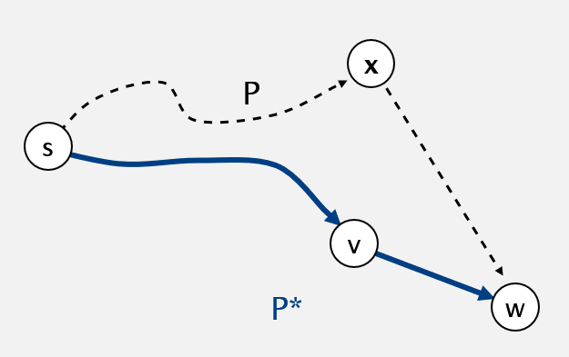
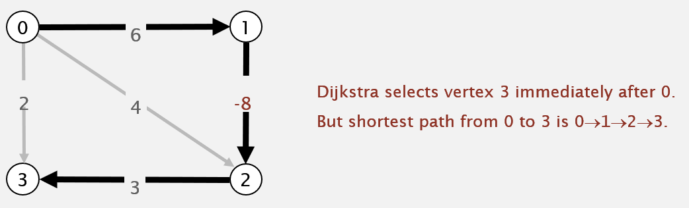
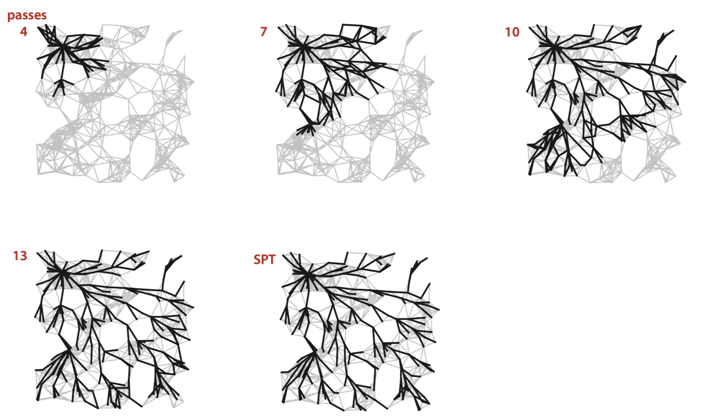
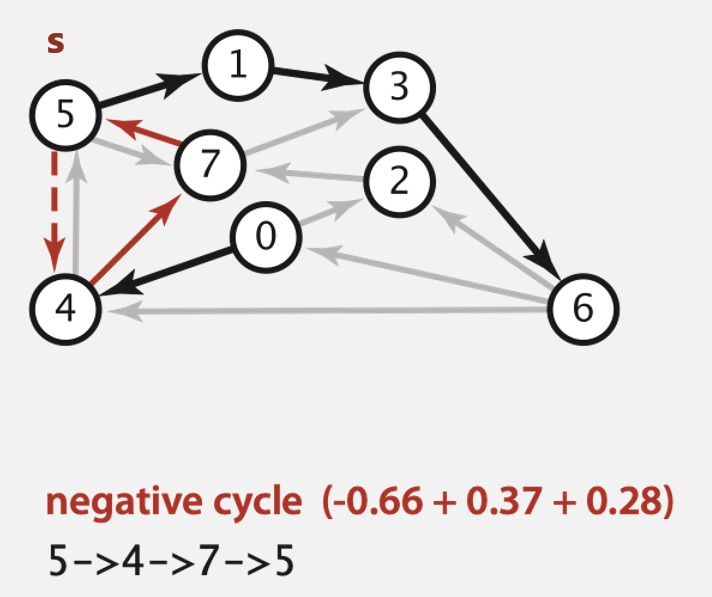

# Shortest Paths

## Edge-weighted digraph API

**有向權重的有向邊**

```java
public class DirectedEdge{
    //Constructor, weighted edge v→w
    DirectedEdge(int v, int w, double weight);
    int from();              // vertex v
    int to();                // vertex w
    double weight();         // weight of this edge
    String toString();       // string representation
}
```

**有權重的有向圖**

```java
public class EdgeWeightedDigraph{
    EdgeWeightedDigraph(int v);           // edge-weighted digraph with V vertices
    void addEdge(DirectedEdge e);         // add weighted directed edge e
    Iterable<DirectedEdge> adj(int v);    // edges pointing from v
    int V();                              // numbers of vertices
    int E();                              // numbers of edges
    Iterable<DirectedEdge> edges();       // all edges
    String toString();                    // string representation
}
```

## Dijkstra's algorithm

> 尋找單源最短路徑
> 
> 圖中可以有 cycle，但不可以有 negative cycle
> 
> **Method**
> 
> 1. Consider vertices in increasing order of distance from s
>    
>    (none-tree vertex with the longest distTo[] value)
> 
> 2. Add vertex to tree and relax all edges pointing from that vertex

```java
public class DijkstraSP{
    private DirectedEdge[] edgeTo;   //記錄最終會到達此點的那個邊
    private double[] distTo;         //起始點 s 到該點的最短距離
    private IndexMinPQ<Double> pq;

    public DijkstraSP(EdgeWeightedDigraph G, int s){
        edgeTo = new DirectedEdge[G.V()];
        distTo = new double[G.V()];
        pq = new IndexMinPQ<Double>(G.V());
        for(int v=0; v<G.V(); v++){
            distTo[v] = Double.POSITIVE_INFINITY;
        }
        distTo[s] = 0.0;
        pq.insert(s, 0.0);

        while(!pq.isEmpty()){
            int v = pq.delMin();
            //將目前優先佇列中最小邊取出
            //找出與其相連的邊
            //並將他們鬆弛
            for(DirectedEdge e : G.adj(v)){
                relax(e);
            }
        }
    }

    private void relax(DirectedEdge e){
        int v = e.from(), w = e.to();
        //如果透過 e 點會比較短
        //那麼就使路徑經過 e 點
        //並更改 distTo[], edgeTo[] 以及 priority queue

        if(distTo[w] > distTo[v] + e.weight()){
            distTo[w] = desiTo[v] + e.weight();
            edgeTo[w] = e;
            if(pq.contains(w)){
                pq.decreaseKey(w, distTo[w]);
            }else{
                pq.insert(w, distTo[w]);
            }
        }
    }

    public double distTo(int v){
        return distTo[v];
    }

    public Iterable<DirectedEdge> pathTo(int v){
        Stack<DirectedEdge> path = new Stack<DirectedEdge>();
        for(DirectedEdge e = edgeTo[v]; e!=nil; e=edgeTo[e.from()]){
            path.push(e);
        }
        return path;
    }
}
```

### Data structures for single-source shortest paths

> **Goal.** Find the shortest path from *s* to every other vertex.
> 
> **Observation.** A shortest-path tree (SPT) solution exists. Why?
> 
> **idea.** Represent the SPT with two vertex-indexed arrays:
> 
> + distTo[v] is length of shortest path from *s* to *v*
> 
> + edgeTo[v] is last edge on shortest path from *s* to *v*

### performance guarantee

> Dijkstra's algorithm uses extra space proportional to V and time proportional to **ElogV** (in the worst case) to compute the SPT rooted at a given source in an edge-weighted digraph with **E** edges and **V** vertices.

### Shortest paths API

> 尋找單源最短路徑
> 
> 圖中不可以有 cycle，也不可以有負權重
> 
> 主要是利用 topological sort 來減少 priority queue 的負擔

```java
public class SP{
    SP(EdgeWeightedDigraph G, int s);      //在圖 G 中以 s 為起點的單源最短路徑
    double distTo(int v);                  //從 s 開始到 v 上的最短徑長度
    Iterable<DirectedEdge> pathTo(int v);  //從 s 到 v 上的最短徑
    boolean hashPathTo(int v);             //是否有路徑從 s 到 v 
}
```

### Dijkstra's algorithm: correctness proof

> **invariant.** For *v* in *T*, distTo[v] is the length of the shortest path from *s* to *v*.
> 
> *T* : partial shortest path tree
> 
> **pf.** 
> 
> 1. Let *w* be next vertex added to *T*
> 
> 2. Let P\* be *s* ↝ *w* path through *v*
> 
> 3. Consider any other s ↝ w path *P*; let *x* be first vertex to *w*.
> 
> 4. *P* is already as long as P\* as soon as it reaches x.
> 
> 5. Thus, distTo[w] is the length of the shortest path from *s* to *w*



### Dijkstra's algorithm: Performance Guarantee

> Performance Guarantee (效能保證)
> 
> Dijkstra's algorithm uses extra space proportional(成比例的) to **V** and time proportional(成比例的) to **ElogV** (in the worst case)
> 
> **空間**
> 
> distTo[] 長度為 V (用來記錄某頂點到該頂點最短距離) 
> 
> edgeTo[] 長度 V 來對應 distTo[] 內所記錄長度的那個點
> 
> Priority Queue 長度 V 是用來儲存當前 s 到 其他點之距離
> 
> 所以空間方面都是耗費 V 的倍數
> 
> **時間**
> 
> 每次從 priority queue 拿出點時，需要花費 logV 的時間，一共需要拿出 E 次，所以是 **ElogV**

### Computing a spanning tree in a graph

**Dijkstra's algorithm seem familiar?**

+ Prim's algorithm is essentially the same algorithm.

+ <u>Both are in a family of algorithm that compute spanning tree.</u>

**<mark>Main distinction</mark>** Rule used to choose next vertex for the tree.

+ Prim: Closet vertex <u>to the tree</u> (via an undirected edge).

+ Dijkstra: Closet vertex <u>to the source</u> (via a directed path).

---

> **Shortest path variants**
> 
> + Single source: from one vertex *s* to every other vertex.
> 
> + Source-Sink: from one vertex *s* to another *t*.
>   
>   + use Dijkstra's algorithm, but terminate the search as soon as *t* comes off the priority queue.
> 
> + All pairs: between all pairs of vertices.

---

## Edge-weighted DAGs

> **What if finding shortest paths in a DAG**
> 
> + Consider vertices in topological sort
> 
> + Relax all edges pointing from that vertex.

```java
public class Aslicp{
    private DirectedEdge[] edgeTo;
    private double[] distTo;
    public Acylicp(EdgeWeightDigraph G, int s){
        edgeTo = new DirectedEdge[G.V()];
        distTo = new double[G.V()];
        for(int v=0; v<G.v(); v++){
            distTo[v] = Double.POSITVIVE_INFINITY;
        }
        distTo[s] = 0.0;

        Topological topological = new Topological(G);
        //由拓僕排序的順序進行走訪
        for(int v : topological.order()){
            //將點換成邊
            for(DirectedEdge e : G.adg(v)){
                relax(e);
            }
        }
    }
}
```

### Shortest paths in edge-weighted DAGs & correctness proof

**Proposition.** Topological sort algorithm computes SPT in any edge-weighted DAG in time proportional to E + v

**Pf.**

+ Each edge e = v→w is relaxed exactly once (when vertex v is relaxed), leaving distTo[w]  ≤ distTo[w] + e.weight()

+ Inequality holds (不等式成立) until algorithm terminates because:
  
  + distTo[w] cannot increase
  
  + distTo[v] will not change

+ Thus, upon termination, shortest-paths optimality conditions holds.

> 直觀一點來說
> 
> 比如我現在想要處理點 d 在處理點 d 之前，原點到 d 所有路過的點我都已經走過了(因為我是照著 topological sort 作relax) 

### Longest paths in edge-weighted DAGs

> 1. Negative all weights.
> 
> 2. Find shortest paths.
> 
> 3. Negate weights in result.
> 
> **Key point.** Topological sort algorithm works even with negative weights. (Topological sort 本來就沒在看權重)

## Bellman-Ford algorithm

> **Shortest paths with negative weights: failed attempts**
> 
> **Dijkstra.** Doesn't work negative edge weights.
> 
> 
> 
> **Re-weighting:**
> 
> 將所有權重 + 8：不可行，因為比如你從 0 到 3 的過程比以前多 8 ，但你從 0 到 1 到 2 卻回比以前多 16，所以把全部的權重都加 8 是不可行的
> 
> **Conclusion:** Need a different algorithm

**Bellman-Ford**

> 1. Initialize distTo[s] = 0 and distTo[v] = infinity for all over vertices.
> 
> 2. Repeat V times:
>    
>    ─ Relax each edge in any order.
> 
> ```java
> for(int i=0; i<G.V(); i++){
>     for(int v=0; v<G.V(); v++){
>         for(DirectedEdge e : G.adj(v)){
>             relax(e);
>         }
>     }
> }
> ```
> 
> > <mark>Repeat V times: relax all E edges</mark>
> 
> **Pf Idea.** After pass i. found shortest path to each vertex v for which the shortest path from *s* to *v* contains *i* edges (or fewer)
> 
> 

**Bellman-ford algorithm: queue-based implementation**

> **Observation:** <u>if distTo[v] does not change during pass i.</u>
> 
> <u>no need to relax any edge pointing from v in pass i+1.</u>
> 
> **FIFO implementation**
> 
> Maintain queue of vertices whose distTo[] changed
> 
> **Overall effect**
> 
> + The running time is still proportional to *E × V* in worst case.
> + But mush faster than that in practice that in practice (E+V).

**implement**

```java
public class BellmanFordSP{
    private double[] distTo;        //從起始點到該點的當前最短距離
    private DirectedEdge[] edgeTo;  //連結到該點的前一個點
    private boolean [] onQ;         //避免重複將點加入queue裡
    private Queue<Interger> queue;  //記錄distTo[]有改變的點

    public BellmanFordSPT(EdgeWeightedDigraph G, int s){
        distTo = new double[G.V()];
        edgeTo = new DirectedEdge[G.V()];
        onQ    = new boolean[G.V()];
        queue  = new Queue<Integer>();

        //先將 s 到各點距離設為無限遠
        for(int v=0; v<V; v++){
            distTo[v] = Double.POSITIVE_INFINITY;
        }
        distTo[s] = 0.0;


        queue.enqueue(s);
        while(!queue.empty()){
            int v = queue.dequeue();
            onQ[v] = false;
            for(DirectedEdge e : G.adj(v)){
                relax(e);
            }
        }
    }

    private void relax(DirectedEdge e){
        int v = e.from(), w = e.to();
        //如果 從 s->v->w 比從 s->w 快 那就 relax
        if(distTo[w] > distTo[v] + e.weight()){
            distTo[w] = distTo[v] + e.weight();
            edgeTo[w] = e;

            if(!onQ[w]){
                queue.enqueue(w);
                onQ[w] = true;
            }
        }
    }
}
```

### Bellman-ford correctness proof

> **Bellman-ford algorithm**
> 
> 1. 將 distTo[] 做無限大
> 
> 2. 把每個點都拿出來做 relax
> 
> **proposition.** 用不同 order 來 relax 不會影響答案
> 
> **pf.** 
> 
> some order: e1→e2→e3→e4
> 
> another order: e4→e3→e2→e1
> 
> 在第一 run 時可以找出從原點到其他點一步之內的最短距離
> 
> 在第二 run 時可以找出從原點到其他點兩步之內的最短距離
> 
> 在第三 run 時可以找出從原點到其他點三步之內的最短距離
> 
> ...
> 
> 在第 V run 時可以找出從原點到其他點 V 步之內的最短距離
> 
> 因為只有 V 個點，所以跑到 V 就可以停了

## Cost summary

| algorithm                    | restriction             | typical case | worst case | extra space |
|:----------------------------:|:-----------------------:|:------------:|:----------:|:-----------:|
| topological sort             | no directed & no cycled | E + V        | E+V        | V           |
| Dijkstra (binary heap)       | no negative weights     | E log V      | E log V    | V           |
| Bellman - Ford               | no negative cycles      | EV           | EV         | V           |
| Bellman - Ford (queue-based) | no negative cycles      | E + V        | EV         | V           |

> **NOTE**
> 
> 1. Directed cycles make the problem harder
> 2. Negative weighted make the problem harder
> 3. Negative cycles makes the problem intractable(棘手的)

### Negative cycles

**Def.** A negative cycle is a directed cycle whose sum of edge weights is negative.

**Proposition.** A SPT exists iff no negative cycles.

## Bellman-ford to find a negative cycle

Add two method to the API for SP.

```java
boolean hasNegativeCycle();    //Is there a negative cycle?

Iterable<DirectedEdge> negativeCycle();    //negative cycle reachable from s
```



**Finding a negative cycle**

> **Observation.** If there is a negative cycle, Bellman-Ford gets stuck in loop, updating `distTo[]` and `edgeTo[]` entries of vertices in the cycle.
> 
> **Proposition.** If any vertex v is updated in pass v, there exists a negative cycle (and can trace back `edgeTo[v]` entries to find it).
> 
> **In practice.** Check for negative cycles more frequently